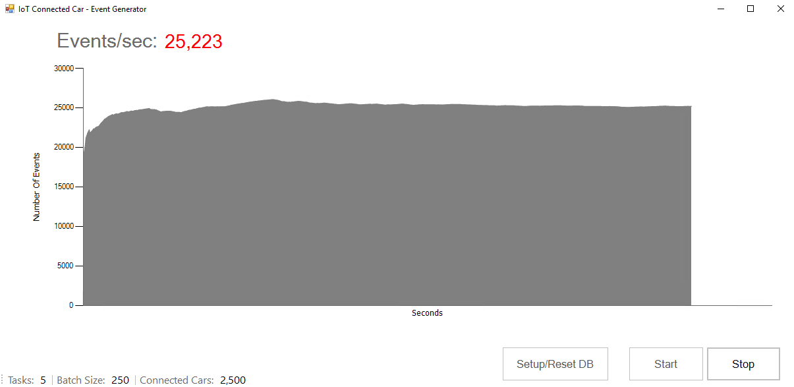

# IoT Connected Car
This code sample demonstrates how a SQL Server 2016 (or higher) memory optimized database could be used to ingest a very high input data rate and ultimately help improve the performance of applications with this scenario. The code simulates an IoT Connected Car scenario where multiple cars are constantly sending telemetry data to an the Azure SQL database.

### Contents

[About this sample](#about-this-sample) 
[Before you begin](#before-you-begin) 
[Run this sample](#run-this-sample) 
[Sample details](#sample-details) 
[Disclaimers](#disclaimers) 
[Related links](#related-links) 

## About this sample

1. **Applies to:** SQL Server 2016 (or higher) Enterprise / Developer / Evaluation Edition, Azure SQL Database (Premium SKUs)
2. **Key features:**
	- Memory Optimized Tables and Table valued Parameters (TVPs)
	- Natively Compiled Stored Procedures
	- System-Versioned Temporal Tables
	- Clustered Columnstore Index (CCI)
	- SQL Graph Extensions
3. **Workload:** Data Ingestion for IoT
4. **Programming Language:** .NET C#, T-SQL
5. **Authors:** Perry Skountrianos [perrysk-msft]

## Before you begin

To run this sample, you need the following prerequisites.

**Software prerequisites:**

1. SQL Server 2016 (or higher) or a Premium Azure SQL Database 
2. Visual Studio 2017 (or higher) with the latest SSDT installed

**Azure prerequisites:**

1. Permission to create an Azure SQL Database

## Run this sample
1. Clone this repository using Git for Windows (http://www.git-scm.com/), or download the zip file.

2. From Visual Studio, open the **iot-connected-car.sln** file from the root directory.

3. Right click **WinFormsClient** and select "Set as StartUp Project" (if it is not already set).

4. In Visual Studio Build menu, select **Build Solution** (or Press F6).

5. Modify the **Db** connection string in **App.config Settings** (located in the **Solution Items** solution folder) to provide YOUR_SERVER, YOUR_USERNAME, and YOUR_PASSWORD 

6. Create the Database and Sample reference data
- Note: For publishing to Azure SQL you need to create a premium database before setting up the schema and sample data 

7. Build the app and run it. 

8. Press the **Setup/Reset DB** button to create the DB schema and sample reference data 

9. Start the workload by pressing the **Start** button

## Sample details

**High Level Description**

**Visual Studio Solution Projects**

1. **Data Generator**: Data Generator client library. Uses multiple async tasks to produce a test data workload.  
2. **WinFormsClient**: Windows Forms Data Generator client.

## Disclaimers
The code included in this sample is not intended to be a set of best practices on how to build scalable enterprise grade applications. This is beyond the scope of this quick start sample.

## Related Links

For more information, see these articles:
- [In-Memory OLTP (In-Memory Optimization)] (https://msdn.microsoft.com/library/dn133186.aspx)
- [OLTP and database management] (https://www.microsoft.com/server-cloud/solutions/oltp-database-management.aspx)
- [SQL Server 2016 Temporal Tables] (https://msdn.microsoft.com/library/dn935015.aspx)
- [In-Memory OLTP Common Design Pattern – High Data Input Rate/Shock Absorber] (https://blogs.technet.microsoft.com/dataplatforminsider/2013/09/19/in-memory-oltp-common-design-pattern-high-data-input-rateshock-absorber/)
- [Power BI Download] (https://powerbi.microsoft.com/en-us/desktop/)
