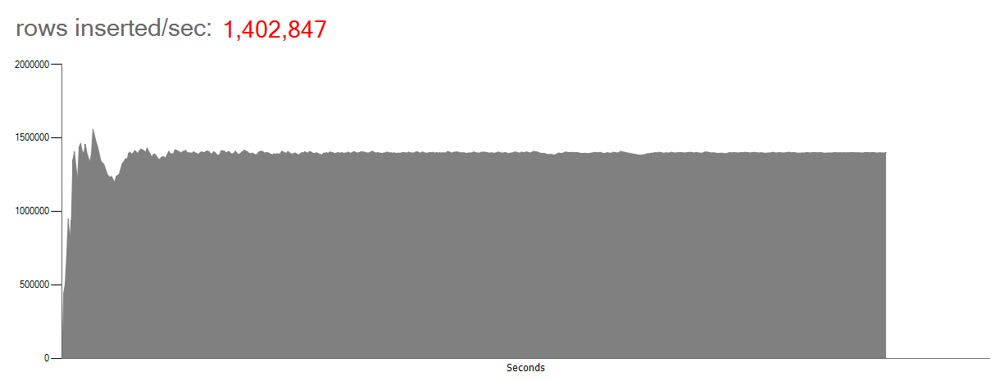

# IoT Smart Grid
This code sample demonstrates how a SQL Server 2016 (or higher) memory optimized database could be used to ingest a very high input data rate and ultimately help improve the performance of applications with this scenario. The code simulates an IoT Smart Grid scenario where multiple IoT power meters are constantly sending electricity usage measurements to the database.

### Contents

[About this sample](#about-this-sample) 
[Before you begin](#before-you-begin) 
[Run this sample](#run-this-sample) 
[Sample details](#sample-details) 
[Disclaimers](#disclaimers) 
[Related links](#related-links) 

## About this sample

1. **Applies to:** SQL Server 2016 (or higher) Enterprise / Developer / Evaluation Edition, Azure SQL Database
2. **Key features:**
	- Memory Optimized Tables and Table valued Parameters (TVPs)
	- Natively Compiled Stored Procedures
	- Clustered Columnstore Index (CCI)
	- Power BI
3. **Workload:** Data Ingestion for IoT
4. **Programming Language:** .NET C#, T-SQL
5. **Authors:** Perry Skountrianos [perrysk-msft]

## Before you begin

To run this sample, you need the following prerequisites.

**Software prerequisites:**

1. SQL Server 2016 (or higher) or an Azure SQL Database
2. Visual Studio 2015 (or higher) with the latest SSDT installed
3. [Power BI Desktop Installed] (https://powerbi.microsoft.com/en-us/desktop/)

**Azure prerequisites:**

1. Permission to create an Azure SQL Database

## Run this sample
1. Clone this repository using Git for Windows (http://www.git-scm.com/), or download the zip file.

2. From Visual Studio, open the **IoT-Smart-Grid.sln** file from the root directory.

3. The sample includes two clients for generating the workload: **ConsoleClient** and **WinFormsClient**. Right click on either of these projects and select "Set as StartUp Project".

4. In Visual Studio Build menu, select **Build Solution** (or Press F6).

5. Modify the **App.config Settings** (located in the **Solution Items** solution folder)

	You might want to adjust the configuration settings according to the hardware specifications of your environment.

	- **Db**:  SQL Server connectionString. Currently it is configured to connect to the local default SQL Server Instance using Integrated Security.
	- **insertSPName**: The name of the Natively Compiled Stored Procedure that inserted the sample data. (Default Value: InsertMeterMeasurement)
	- **deleteSPName**: The name of the Stored Procedure that offloads historical data to a columnstore index (Default Value: InsertMeterMeasurementHistory)
	- **numberOfDataLoadTasks**: The number of Asynchronous Tasks the Data Generator uses.  
	- **numberOfOffLoadTasks**:  The number of Asynchronous Tasks the Data Generator uses.  
	- **numberOfMeters**: The number of IoT Power Meters to be used.
	- **batchSize**: The sample data batch size.  
	- **dataLoadCommandDelay**: The delay between sql calls.
	- **offLoadCommandDelay**: The delay between offload calls.
	- **deleteBatchSize**: Delete Batch size
	- **enableShock**: Flag that turns on/off the data shock. This should be set to 0 for max high volume workload   
	- **commandTimeout**: SQL Command Timeout   
	- **rpsFrequency**: The polling frequency for Rows per Second. (Default Value: 2000ms)    
	- **delayStart**: Delay Graph Interval
	- **logFileName**: Log File Name. (Default Value: log.txt)    
	- **appRunDuration**: Run App duration time
	- **numberOfRowsOfloadLimit**: Number Of Rows Ofload Limit
	- **powerBIDesktopPath**: The local path to the PBIDesktop.exe. (Default Value: C:\Program Files\Microsoft Power BI Desktop\bin\PBIDesktop.exe)

6. Publish the Database
  - Right click on the **Db** SQL Server Database Project and Select **Publish**.
  - Click Edit... to choose your connection string.
		- We recommend choosing **PowerConsumption** as the Database name as this is the default db name the sample is configured to run under.
  - Click Publish.
  - Note: For publishing to Azure SQL you need to
		- Change the DB project target platform to **Microsoft Azure SQL Database V12** and
		- Comment the T-SQL in the **mod.sql** file in the Db/Storage folder before publishing.

7. Build the app and run it. Do not use the debugger, as that will slow down the app.

8. Start the workload
	- From the **ConsoleClient**: Type 'START'
	- From the **WinFormsClient**: Press the **Start** button.

9. Launch the Power BI Report
	- From the **ConsoleClient**: Type 'REPORT' on the command prompt window.
	- From the **WinFormsClient**: Click the **Power BI Report** link.

10. In the Power BI Desktop menu click on **Edit Queries** and then **Source** to make sure that both the Server and the Database Name match the values from **Step 6**. Click OK to apply changes.

## Sample details

**High Level Description**

This code sample simulates an IoT Smart Grid scenario where multiple IoT power meters are sending electricity usage measurements to a SQL Server memory optimized database. The Data Generator can be started either from the Console or the Windows Form client. Every async task in the Data Generator produces a batch of records with random values in order to simulate the data of an IoT power meter. It then calls a natively compiled stored procedure, that accepts an memory optimized table valued parameter (TVP), to insert the data into an memory optimized SQL Server table. In addition to the in-memory features, the sample is leveraging [Clustered Columnstore Index](https://msdn.microsoft.com/en-us/library/dn817827.aspx) for enabling real time operational analytics, and [Power BI](https://powerbi.microsoft.com/en-us/desktop/) for data visualization.

**Visual Studio Solution Projects**

1. **ConsoleAppClient**: Console Data Generator client. Uses START | STOP | HELP | REPORT | EXIT commands.
2. **Data Generator**: Data Generator client library. Uses multiple async tasks to produce a test data workload.  
3. **Db**: SQL Server Database project
4. **WFClient**: Windows Forms Data Generator client.

## Disclaimers
The code included in this sample is not intended to be a set of best practices on how to build scalable enterprise grade applications. This is beyond the scope of this quick start sample.

## Related Links
<!-- Links to more articles. Remember to delete "en-us" from the link path. -->

For more information, see these articles:
- [In-Memory OLTP (In-Memory Optimization)] (https://msdn.microsoft.com/en-us/library/dn133186.aspx)
- [OLTP and database management] (https://www.microsoft.com/en-us/server-cloud/solutions/oltp-database-management.aspx)
- [In-Memory OLTP Common Design Pattern – High Data Input Rate/Shock Absorber] (https://blogs.technet.microsoft.com/dataplatforminsider/2013/09/19/in-memory-oltp-common-design-pattern-high-data-input-rateshock-absorber/)
- [Power BI Download] (https://powerbi.microsoft.com/en-us/desktop/)
