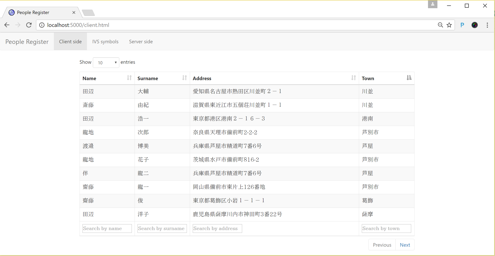

# Japanese IVS text processing

This project contains an example implementation of ASP.NET Core. It shows how SQL Database handles complex text processing rules such as sorting and filtering Japanese IVS ideographs. 

In the application you can see a table containg information about people written with Japanese symbols:



If you open this page and try to sort columns by town, you might see unexpected results. Notice that rows are sorted by town column; however, people from town 芦󠄂屋 are in the 5th and 7th rows, and people from town 芦󠄆別市 are in the 4th, 6th, and 8th rows. Obviously, although the table is sorted by town column, sort order is not correct. 

The reason for this behavior is that some client-side components do not understand some text comparison rules specific to some languages. In this example, the problem is with the IVS characters used in town names. If you take a better look at the towns, you will see slight differences in the shapes of the symbols used to write towns starting with symbol 芦󠄆.

In written Japanese there are different shapes of the same symbol written with small differences. In the following figure, you can see 3 variations of symbol U+8FBA, 16 variations of symbol U+9089, and 10 variations of symbol U+908A: 


There might be differences in a few strokes, but these are still the same symbols. An additional problem is that these symbols are not identically binary encoded. Each symbol has a first character that defines the actual value of the symbol (e.g. U+8FBA), followed by an additional character that describes what is the variation of the symbol (e.g. U+E0101, U+E0102). This additional symbol is called a variation selector character. Unfortunately, some client-side components do not take variation selector characters into account, so sort/filter results might be incorrect.

SQL Database has powerful text processing options with which you can exactly specify what linguistic rues should be applied. As an example, you can specify that town column contains Japanese characters and that Japanese linguistic rules should be applied when strings are compared or ordered:

```sql
alter table people
	alter column town nvarchar(50) collate Japanese_Bushu_Kakusu_140;
```

**collate Japanese_Bushu_Kakusu_140** would tell SQL Database that the text stored in the town column contains Japanese characters, and that SQL queries should use sorting and comparison rules specific to Japanese linguistic rules.
If you switch to the server.html page and sort results by town, you will see that towns are correctly sorted. The difference is in the fact that sort and filter operations are sent to the server-side via AJAX calls, and processed in T-SQL using **where** and **order by** clauses that apply Japanese linguistic rules specified in the column definition. Results that are processed using build in T-SQL linguistic rules are shown in the table.

In addition, SQL Database enables you to customize rules for each column. The following code sample shows several of these options. It specifies case insensitive search, enables Kana sensitivity for sorting using the difference between Japanese Hiragana and Katakana symbols, and indicates that T-SQL queries should use variation selectors when comparing two IVS symbols (new VSS flag):

```sql
alter table people
	alter column town nvarchar(50) collate Japanese_Bushu_Kakusu_140_CI_AI_KS_WS_VSS;
```

## Contents

[About this sample](#about-this-sample)<br/>
[Before you begin](#before-you-begin)<br/>
[Run this sample](#run-this-sample)<br/>
[Sample details](#sample-details)<br/>
[Disclaimers](#disclaimers)<br/>
[Related links](#related-links)<br/>

<a name=about-this-sample></a>

## About this sample

- **Applies to:** SQL Server 2017 (or higher), Azure SQL Database
- **Key features:** Collation rules in SQL Server 2016/Azure SQL Database
- **Programming Language:** C#, Html/JavaScript, Transact-SQL
- **Authors:** Jovan Popovic

<a name=before-you-begin></a>

## Before you begin

To run this sample, you need the following prerequisites.

**Software prerequisites:**

1. SQL Server 2017 CTP1 (or higher) or an Azure SQL Database
2. [ASP.NET Core](https://www.microsoft.com/net/core#windowscmd)

**Azure prerequisites:**

1. Permission to create an Azure SQL Database.
1. Permission to create an Azure Web App.

<a name=run-this-sample></a>

## Run this sample

### Setup

1. Download the source code from the SQL Server GitHub account.

2. From SQL Server Management Studio or Sql Server Data Tools, connect to your SQL Server 2016 or Azure SQL database and execute [sql-scripts/setup.sql](sql-scripts/setup.sql). This will create a People table populated with demo data.

3. Add a connection string in the appsettings.json or appsettings.development.json file. An example of the content of appsettings.development.json is shown in the following configuration:

```
{
  "ConnectionStrings": {
    "IVSDemo": "Server=.;Database=PeopleRegister;Integrated Security=true"
  }
}
```

If your database is hosted on Azure you can add something like:
```
{
  "ConnectionStrings": {
    "IVSDemo": "Server=<<SERVER>>.database.windows.net;Database=PeopleRegister;User Id=<<USER>>;Password=<<PASSWORD>>"
  }
}
```

>**Note**
> This sample build uses dotnet core version 1.0.0. If your build fails because you have some other version, you should change the version in project.json file.
```
"Microsoft.NETCore.App": {
      "version": "1.0.0",
      "type": "platform"
    }
```
As an alternative you can deploy the app directly to Azure Web App.
[](https://azuredeploy.net/)

### Build and run sample

1. Open the command prompt in your project root folder and run **dotnet restore** and **dotnet build** commands. If you are using Visual Studio, you can build your solution using Ctrl+Shift+B, right-click on project + Build, Build/Build Solution from menu. 

2. Run the sample app using **dotnet run** executed in the command prompt of the project root folder. As an alternative you can use F5 or Ctrl+F5 in Visual Studio 2015.
   
3. Open /client.html Url to get all people from database.

4. Sort by town to see that some towns are not correctly sorted.

5. Open /server.html Url to get all people from database using server-side processing code.
   
6. Sort by town to see that towns are correctly sorted.

<a name=sample-details></a>

## Sample details

This sample application is implemented as an ASP.NET Core application where most of the processing is done on the front-end (JavaScript) or backend (T-SQL).
Front-end code is implemented using JQuery, and JQuery Datatables component.
Server-side code is implemented using ASP.NET Core Web API. Server-side code serves AJAX requests sent from client page and returns JSON responses formatted in via T-SQL queries in database.

<a name=disclaimers></a>

## Disclaimers
The code included in this sample is not intended demonstrate some general guidance and architectural patterns for web development.
You can easily modify this code to fit the architecture of your application.

<a name=related-links></a>

## Related Links

You can find more information about the components that are used in this sample in these locations: 
- [ASP.NET Core](http://www.asp.net/core).
- [JSON Support in Sql Server](https://msdn.microsoft.com/en-us/library/dn921897.aspx).
- [JQuery DataTables]( https://datatables.net/).

## Code of Conduct
This project has adopted the [Microsoft Open Source Code of Conduct](https://opensource.microsoft.com/codeofconduct/). For more information see the [Code of Conduct FAQ](https://opensource.microsoft.com/codeofconduct/faq/) or contact [opencode@microsoft.com](mailto:opencode@microsoft.com) with any additional questions or comments.

## License
These samples and templates are all licensed under the MIT license. See the license.txt file in the root.

## Questions
Email questions to: [sqlserversamples@microsoft.com](mailto: sqlserversamples@microsoft.com).