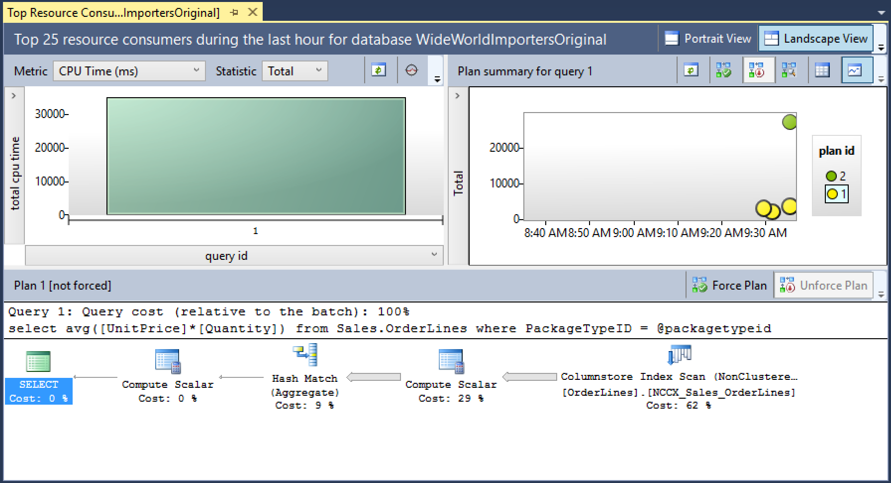
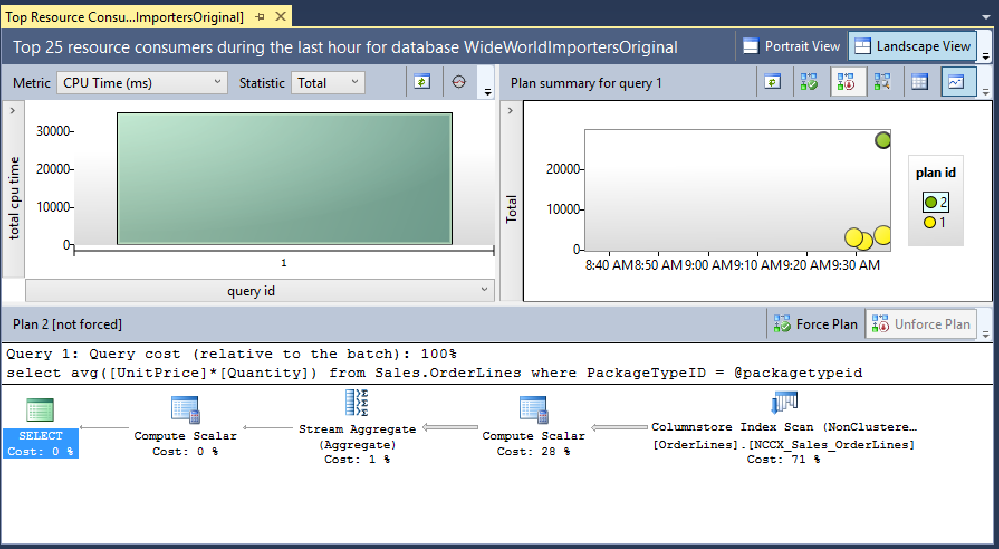
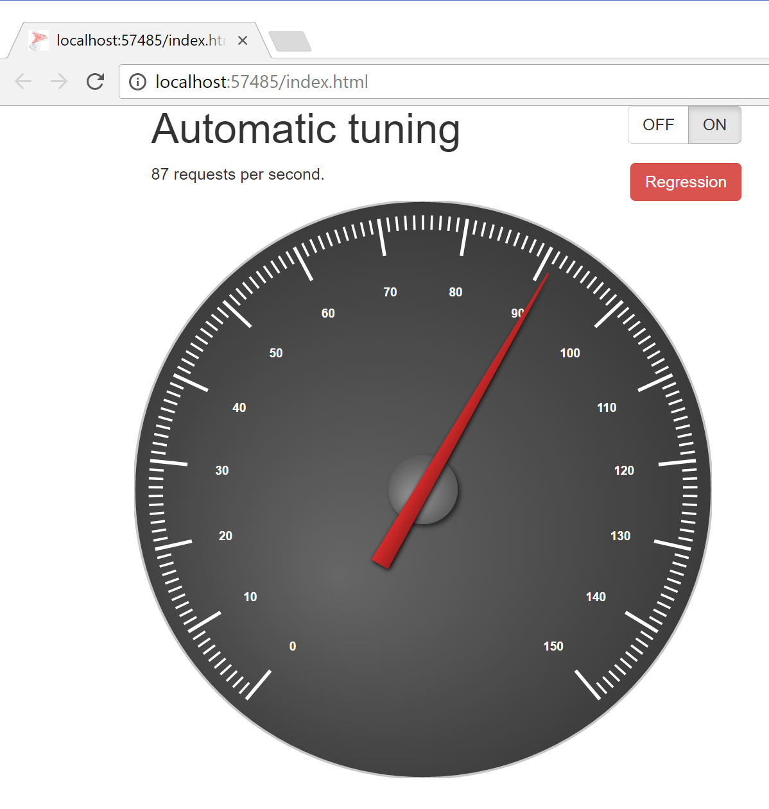
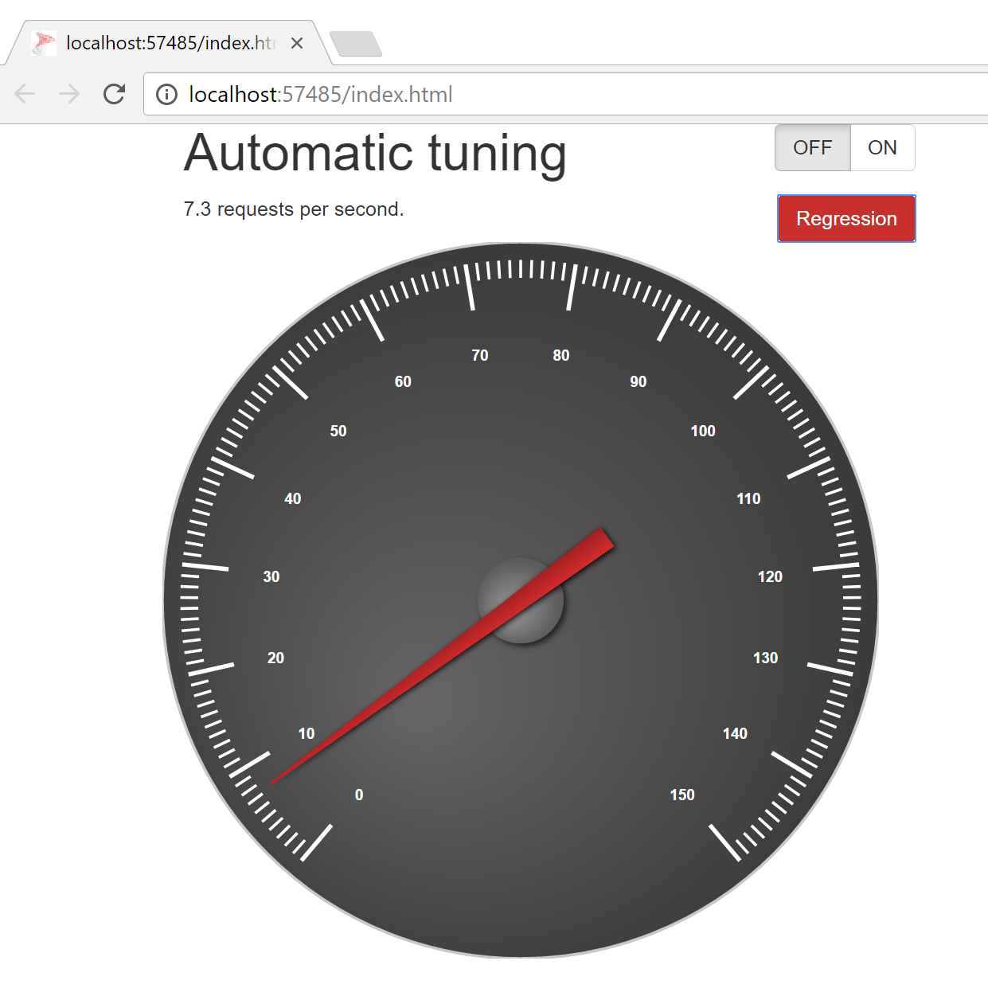

# Forcing last good plan
This code sample demonstrates how [Automatic tuning in SQL Server 2017 CTP2.0+](https://docs.microsoft.com/sql/relational-databases/automatic-tuning/automatic-tuning) can identify and automatically fix performance problems in your workload.

### Contents

[About this sample](#about-this-sample)<br/>
[Before you begin](#before-you-begin)<br/>
[Run this sample](#run-this-sample)<br/>
[Sample details](#sample-details)<br/>
[Disclaimers](#disclaimers)<br/>
[Related links](#related-links)<br/>

<a name=about-this-sample></a>

## About this sample 
1. **Applies to:** SQL Server 2017 (or higher) Enterprise / Developer / Evaluation Edition
2. **Key features:**
    - Automatic tuning / forcing last good plan
    - Query Store
3. **Workload:** Single analytic query executed on [WideWorldImporters](../../../databases/wide-world-importers) database
4. **Programming Language:** T-SQL, .NET C#, JavaScript
5. **Author:** Jovan Popovic [jovanpop-msft]

There are two ways to demonstrate the feature using this sample:
 - Level 300 demo: T-SQL code that simulates workload using T-SQL commands and shows results using dynamic management views and Query Store UI in SQL Server Management Studio.
 - Level 100-200 demo: ASP.NET application that simulates workload using AJAX requests sent to web server and shows results in the web page. Optionally use Query Store UI in SQL Server Management Studio to show performance regressions.

<a name=before-you-begin></a>

## Before you begin

To run this sample, you need the following prerequisites.

**Software prerequisites:**

1. SQL Server 2017 CTP2.0 (or higher)
2. ASP.NET Core 1.0.1 installed (only if you want to use ASP.NET sample). Optionally Visual Studio Code or Visual Studio 2015 U3 (or higher)

<a name=run-this-sample></a>

## Run this sample

### Setup code
1. Download [two T-SQL script files in sql-scripts](sql-scripts) folder if you want to use just T-SQL sample. Optionally you can clone this repository using [Git for Windows](http://www.git-scm.com/), or download the zip file.
2. Download the [WideWorldImporters](../../../databases/wide-world-importers) database and restore it on your server.
3. Execute setup.sql script on your [WideWorldImporters](../../../databases/wide-world-importers) database that will add necessary stored procedures and indexes.

### Configure ASP.NET sample (Only for ASP.NET Sample)
1. Clone this repository using [Git for Windows](http://www.git-scm.com/), or download the zip file, if you have not done it.
2. Open appsettings.json file in the root of the folder and change server, database, username, and password in the connection string.
3. From the project root folder open command prompt and run `dotnet update`, `dotnet build`, and `dotnet run`. These commands will update NuGet packages, build project, and run web app. As an alternative,
open project using Visual Studio 2015 U3, or Visual Studio Code, compile and run sample.

<a name=sample-details></a>
## Sample Details

This sample demonstrates how SQL Server 2017 analyzes workload, keep track about the last good
plan that successfully executed the query in the past, and reverts regressed plan if it is worse that the last known good plan.
The following query is used to demonstrate plan regression and correction:

```
select avg([UnitPrice]*[Quantity])
from Sales.OrderLines
where PackageTypeID = @packagetypeid
```

This query is executed against [WideWorldImporters](../../../databases/wide-world-importers) database. The query can be executed using SQL plan that has **"Hash aggregate"** operator, which provides results quickly. However, sometime Query Optimizer might choose a plan with **"Stream aggregate"** operator that will cause the performance regression. This sample shows how Automatic tuning feature detects this kind of regression and automatically fix the problem.

### T-SQL Sample
Open **demo-full.sql** and follow the comments in the code. Here is the short explanation of the scenario:

#### Part I - regression detection
 - Execute query `EXEC dbo.report 7` 30-300 times. SQL Database will collect statistics about the query. Number of queries that should be executed might vary depending on performance of your server (30 would be enough, but you might need to increase this number).
 - Execute query `EXEC dbo.regression` to cause the regression.
 - Execute query `EXEC dbo.report 7` 20 times and verify that the execution is slower.
 - Query `sys.dm_db_tuning_recommendations` and verify that regression is detected and that
 the correction script is in the view. Since some information are formatted as JSON docuemnts, you can use the following query to extract relevant information:

```
SELECT planForceDetails.query_id, reason, score,
      JSON_VALUE(details, '$.implementationDetails.script') script,
      planForceDetails.[new plan_id], planForceDetails.[recommended plan_id]
FROM sys.dm_db_tuning_recommendations
  CROSS APPLY OPENJSON (Details, '$.planForceDetails')
    WITH (  [query_id] int '$.queryId',
            [new plan_id] int '$.regressedPlanId',
            [recommended plan_id] int '$.forcedPlanId'
          ) as planForceDetails;
```

 - Open Query Store UI in SSMS (e.g. "Top Resource Consuming Queries") and find the query. Verify that there are two plans - one faster with **Hash Aggregate** and another slower with **Stream Aggregate**, similar to the following figures:


Fig. 1. Optimal plan with "Hash Aggregate".


Fig. 2. Regressed plan with "Stream Aggregate".

 - Take the correction script from the `sys.dm_db_tuning_recommendations` view and force the recommended plan.
 - Execute query `EXEC dbo.report 7` 20 times and verify that the execution is faster. Open Query Store UI in SSMS (e.g. "Top Resource Consuming Queries"), find the query, verify that the plan is forced and that the regression is fixed.

#### Part II - Automatic tuning
 - Reset the database state by executing `EXEC dbo.initialize` procedure, and enable automatic tuning on database.
 - Execute query `EXEC dbo.report 7` 30-300 times.
 - Execute query `EXEC dbo.regression` to cause the regression.
 - Execute query `EXEC dbo.report 7` 20 times and verify that the execution is slower.
 - Query `sys.dm_db_tuning_recommendations` and verify that regression is detected and that
 recommendation is in **Verifying** state.
 - Execute query `EXEC dbo.report 7` 30-50 times and verify that the execution is faster.
 - Open Query Store UI in SSMS (e.g. "Top Resource Consuming Queries") and find the query. Verify that there are two plans - one with **Hash Aggregate** and another with **Stream Aggregate**. Better plan should be forced, and you should see that the forced plan has better performance than regressed plan.

### ASP.NET Core Sample

This code sample contains a simple web page that periodically sends HTTP requests to the Web server. Web server executes T-SQL query against the database, returns query result, and calculates query elapsed time in each iteration.
Web page collects response from the web server, calculates expected throughput based on the
last 10 T-SQL request durations, and displays how many requests per second can be executed.

Open index.html page that will show number of requests per second that can be executed. Turn-on
**Automatic tuning** using the **ON** button. You should see something like to following page:


Fig. 3. Number of requests per seconds.

> Number of requests per second might be different in your environment so, gauge needle might
> be on left or right side. You can change the scale of the gauge if you manually edit index.html
> file and change value 150 in the line 96: `var gauge = new GraphVizGauge("svg", { to: 150 });`
> You can refresh the page after this change and the gauge will be re-scaled.

You can press **Regression** button to cause SQL plan choice regression in database layer. On the web page will be shown decreased number of requests per seconds that can be served.


Fig. 4. Number of requests per seconds after regression.

After some time, you will notice that the regression will be automatically corrected. Pressing the **Regression** button again will not cause any regression.

<a name=disclaimers></a>

## Disclaimers
The code included in this sample is not intended to be a set of best practices on how to build scalable enterprise grade applications. This is beyond the scope of this sample.

<a name=related-links></a>

## Related Links

- [Automatic tuning in SQL Server 2017 CTP2.0+](https://docs.microsoft.com/sql/relational-databases/automatic-tuning/automatic-tuning)
- [sys.dm_db_tuning_recommendations view (Transact-SQL)](https://docs.microsoft.com/sql/relational-databases/system-dynamic-management-views/sys-dm-db-tuning-recommendations-transact-sql)
- [Monitoring Performance By Using the Query Store](https://docs.microsoft.com/en-us/sql/relational-databases/performance/monitoring-performance-by-using-the-query-store)


