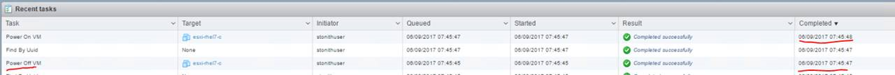
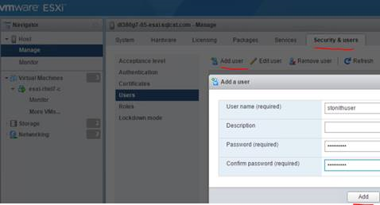
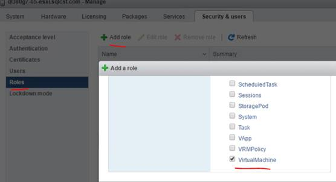
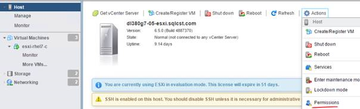
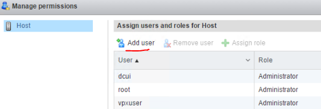
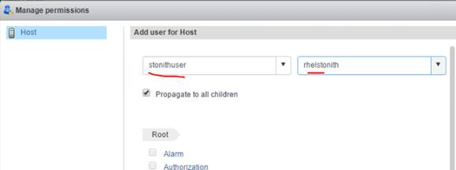

# Configure STONITH With fence_vmare Fencing Agent

>[!NOTE]
>All examples of using fencing agent for vmware in [RHEL documentation](https://access.redhat.com/solutions/306233) are with `-ssl` option ( or `-z`). That “Default” behavior has changed from just checking any certificate to just signed certs that can be validated. Hence in testing use the `–ssl-insecure`. Can use default if you have a valid certificate.

## Manually Test Fencing Device 

The options that are passed in the example below have the following usage: `-a` is IP of Vsphere, `-l` is username, `-p` is password, `-n` is node name you want to fence. Can use `-v` as verbose mode to debug.

```bash
sudo cd /sbin
sudo ./fence_vmware_soap -a 172.16.50.50  -l stonithuser -p 'MyStrongPassword1!' --ssl-insecure  --action status -n esxi-rhel7-c
```
Output:
```bash
/usr/lib/python2.7/site-packages/urllib3/connectionpool.py:769: InsecureRequestWarning: Unverified HTTPS request is being made. Adding certificate verification is strongly advised. See: https://urllib3.readthedocs.org/en/latest/security.html
Status: ON
```

## Create Fencing Agent Resource

To create the resource run the following commands:
```bash
sudo pcs stonith create esxi-rhel7-c_fence fence_vmware_soap ipaddr=172.16.50.50 ssl_insecure=1 login=stonithuser passwd='MyStrongPassword1!' pcmk_host_list=esxi-rhel7-c
```

## Check Status

Run the following commands to check the status of the cluster nodes and reources:
```bash
sudo pcs status
```
Sample output:
```bash
3 nodes and 5 resources configured
…
…
Full list of resources:

Master/Slave Set: ag_cluster-master [ag_cluster]
     Masters: [ dl380g7-07 ]
     Slaves: [ dl380g7-08 ]
     Stopped: [ esxi-rhel7-c ]
virtualip      (ocf::heartbeat:IPaddr2):       Started dl380g7-07
esxi-rhel7-c_fence     (stonith:fence_vmware_soap):    Started dl380g7-08
```

## Testing

```bash
sudo pcs stonith fence esxi-rhel7-c
```
You can see it will turn the VM off and then back on:
 

 ## VMware Permissions

On VMware vSphere, in order to use limited set of permissions, create a specific user in ESXI to not use root:
 

Created a Role with only subset of permissions:
 

Tie the 2 together aka assign user to the role:
 
 
 