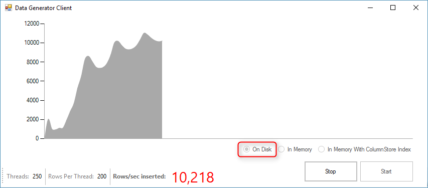
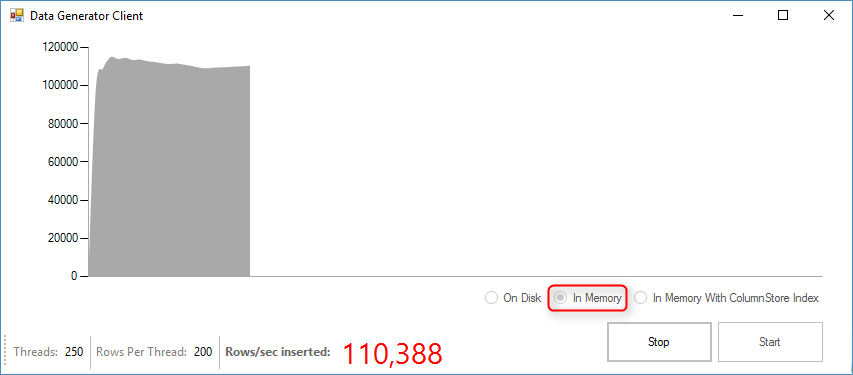
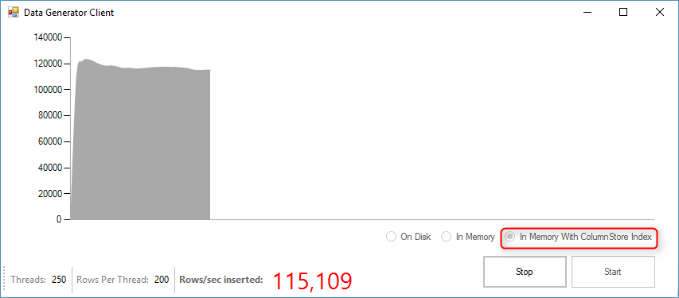

# Wide World Importers - Sales Orders
This Windows Forms sample application built on .NET Framework 4.6  demonstrates the performance benefits of using SQL Server memory optimized tables and native compiled stored procedures. You can compare the performance before and after enabling In-Memory OLTP by observing the transactions/sec as well as the current CPU Usage and latches/sec.

### Contents

[About this sample](#about-this-sample) 
[Before you begin](#before-you-begin) 
[Run this sample](#run-this-sample) 
[Sample details](#sample-details) 
[Disclaimers](#disclaimers) 
[Related links](#related-links) 

## About this sample

1. **Applies to:** SQL Server 2016 (or higher) Enterprise / Developer / Evaluation Edition, Azure SQL Database
2. **Key features:**
	- Memory Optimized Tables and Table valued Parameters (TVPs)
	- Natively Compiled Stored Procedures
	- Clustered Columnstore Index (CCI)
3. **Workload:** Data Ingestion for Wide World Importers (Customer Orders table)
4. **Programming Language:** .NET C#, T-SQL
5. **Authors:** Perry Skountrianos [perrysk-msft]

## Before you begin

To run this sample, you need the following prerequisites.

**Software prerequisites:**

1. SQL Server 2016 (or higher) or an Azure SQL Database
2. Visual Studio 2015 (or higher) with the latest SSDT installed
3. Wide World Importers Database restored

**Azure prerequisites:**

1. Permission to create an Azure SQL Database

## Run this sample
1. Clone this repository using Git for Windows (http://www.git-scm.com/), or download the zip file.

2. From Visual Studio, open the **WWI-SalesOrders.sln** file from the root directory.

3. In Visual Studio Build menu, select **Build Solution** (or Press F6).

4. Modify the **App.config Settings** (located in the **Solution Items** solution folder)

	- **Db**:  SQL Server connectionString. Currently it is configured to connect to the local default SQL Server Instance using Integrated Security.

5. Open the CustomerOrders.sql SQL script (located under scripts) and run it against the World Wide Importers DB.

5. Build the app and run it. Do not use the debugger, as that will slow down the app.

6. You can see the performance gains by switching to the In-Memory radio button option.  

The perf gains from In-Memory OLTP as shown by the load generation app depend on two factors:
-	Hardware
  -	more cores => higher perf gain
  -	slower log IO => lower perf gain
-	Configuration settings in the load generator
  -	more rows per transaction => higher perf gain
  -	more reads per write => lower perf gain

## Sample details

**High Level Description**

This code sample demonstrates the performance gains of SQL Server 2016 (or higher) In-Memory tables and natively compiled Stored procedures.

## Disclaimers
The code included in this sample is not intended to be a set of best practices on how to build scalable enterprise grade applications. This is beyond the scope of this quick start sample.

## Related Links
<!-- Links to more articles. Remember to delete "en-us" from the link path. -->

For more information, see these articles:
- [In-Memory OLTP (In-Memory Optimization)] (https://msdn.microsoft.com/en-us/library/dn133186.aspx)
- [OLTP and database management] (https://www.microsoft.com/en-us/server-cloud/solutions/oltp-database-management.aspx)
- [SQL Server 2016 Temporal Tables] (https://msdn.microsoft.com/en-us/library/dn935015.aspx)
