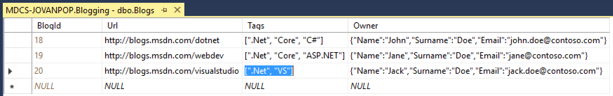

# Entity Framework Core 1.1. - Getting started with JSON fields in SQL Server

This project contains an example implementation of ASP.NET MVC application that shows how to serialize/de-serialize complex fields in Entity Framework model as JSON fields in SQL database.
JSON support enables you to represent complex user defined structures such as objects and arrays in cells as JSON object.



This way, you don't need to create separate tables for each complex object that you have in your classes. 
In this example, rows from Blog table with JSON fields are mapped to the Blog class using Tags and Owner properties. Owner is object of Person type that don't have separate table.

```C#

    public class Blog
    {
        public int BlogId { get; set; }

        [Url]
        public string Url { get; set; }

        public List<Post> Posts { get; set; }

        public string[] Tags { get; set; }

        public Person Owner { get; set; }

    }

    public class Person
    {
        [Required]
        public string Name { get; set; }

        public string Surname { get; set; }

        [EmailAddress]
        public string Email { get; set; }
    }
```

In this example, you can see how to read and store JSON fields from the database into EF model objects, show them and store them in ASP.NET MVC.

## Contents

[About this sample](#about-this-sample)<br/>
[Before you begin](#before-you-begin)<br/>
[Run this sample](#run-this-sample)<br/>
[Sample details](#sample-details)<br/>
[Related links](#related-links)<br/>

<a name=about-this-sample></a>

## About this sample

- **Applies to:** SQL Server 2016 (or higher), Azure SQL Database
- **Key features:** JSON support in SQL Server, Entity Framework, ASP.NET MVC.
- **Programming Language:** C#, ASP.NET Core, Transact-SQL
- **Authors:** Jovan Popovic

<a name=before-you-begin></a>

## Before you begin

To run this sample, you need the following prerequisites.

**Software prerequisites:**

1. SQL Server 2016 (or higher) or an Azure SQL Database

2. [ASP.NET Core 1.0 SDK](https://www.microsoft.com/net/core#windows) (or higher) and [Entity Framework Core](https://docs.microsoft.com/en-us/ef/core/)

3. Optional: Visual Studio 2015 Update 3 (or higher) or Visual Studio Code Editor.

**Azure prerequisites:**

1. Permission to create an Azure SQL Database

<a name=run-this-sample></a>

## Run this sample

1. Create a database on SQL Server 2016 or Azure SQL Database.

2. From SQL Server Management Studio or Visual Studio/Sql Server Data Tools connect to your SQL Server 2016 or Azure SQL database and execute **setup.sql** script that will create and populate Blogs and Posts tables.

3. Locate **Setup.cs** file and change connection string in the ConfigureServices method: `var connection = @"Server=.;Database=Blogging;Trusted_Connection=True;";`
            
4. Build the project - Open command prompt in project root folder (the folder that contains **project.json** file), and run following commands: **dotnet restore** to take all necessary NuGet packages, **dotnet build** to build the project. As an alternative, open the **EFGettingStarted.xproj** file from the root directory using Visual Studio 2015 Update 3 (or higher). Restore packages using right-click menu on the project in Visual Studio and by choosing Restore Packages item.

5. Run the sample app using F5 or Ctrl+F5 in Visual Studio 2015, or using **dotnet run** executed in the command prompt of the project root folder.  

<a name=sample-details></a>

## Sample details

This sample shows how to read and write complex fields such as string arrays and objects in the columns in the JSON format. JSON fields in database are stored as NVARCHAR fields and contain JSON representation of array and object.

JSON data from database are serialized/de-serialized through properties in Blog entity.

Blog fields are shown and inserted using ASP.NET MVC framework.

<a name=related-links></a>

## Related Links

You can find more information about the components that are used in this sample on these locations: 
[.Net Core download](https://www.microsoft.com/net/core#windows)
[Entity Framework Core 1.0](https://docs.microsoft.com/en-us/ef/core/).

## Code of Conduct
This project has adopted the [Microsoft Open Source Code of Conduct](https://opensource.microsoft.com/codeofconduct/). For more information see the [Code of Conduct FAQ](https://opensource.microsoft.com/codeofconduct/faq/) or contact [opencode@microsoft.com](mailto:opencode@microsoft.com) with any additional questions or comments.

## License
These samples and templates are all licensed under the MIT license. See the license.txt file in the root.

## Questions
Email questions to: [sqlserversamples@microsoft.com](mailto: sqlserversamples@microsoft.com).
