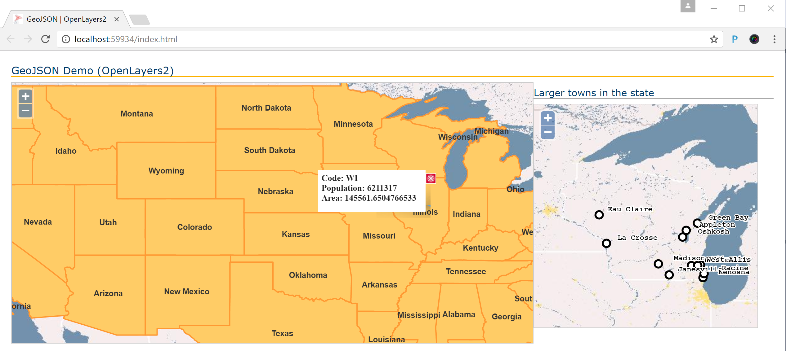

# ASP.NET Core Spatial application that uses SQL/JSON functionalities 

This project contains an example implementation of ASP.NET Core application that shows how to display spatial data from SQL Database on the web page. Web page is shown in the following picture:



Initially will be shown all US states on the larger map. [OpenLayers2](http://openlayers.org/two/) component is used to display data on the map. States are provided in [GeoJSON](http://geojson.org/) format generated in SQL Server.
When you click on any state on the map, details will be shown in popup window, and larger towns in that state will be shown in the details map.

## Contents

[About this sample](#about-this-sample)<br/>
[Before you begin](#before-you-begin)<br/>
[Run this sample](#run-this-sample)<br/>
[Sample details](#sample-details)<br/>
[Disclaimers](#disclaimers)<br/>
[Related links](#related-links)<br/>

<a name=about-this-sample></a>

## About this sample

- **Applies to:** SQL Server 2016 (or higher), Azure SQL Database
- **Key features:** Spatial types and FOR JSON clause in SQL Server 2016/Azure SQL Database
- **Programming Language:** C#, Html/JavaScript, Transact-SQL
- **Authors:** Jovan Popovic, Aleksandar Kiridzic

<a name=before-you-begin></a>

## Before you begin

To run this sample, you need the following prerequisites.

**Software prerequisites:**

1. SQL Server 2016 (or higher) or an Azure SQL Database
2. [ASP.NET Core](https://www.microsoft.com/net/core#windowscmd)
3. [WideWorldImporters](https://github.com/Microsoft/sql-server-samples/releases/tag/wide-world-importers-v1.0) database.

**Azure prerequisites:**

1. Permission to create an Azure SQL Database.

<a name=run-this-sample></a>

## Run this sample

### Setup

1. Download source code from SQL Server GitHub account.

2. Get [WideWorldImporters](https://github.com/Microsoft/sql-server-samples/releases/tag/wide-world-importers-v1.0) database and restore it on your SQL Server instance. 

3. From SQL Server Management Studio or Sql Server Data Tools connect to your SQL Server 2016 or Azure SQL database and execute [sql-scripts/setup.sql](sql-scripts/setup.sql) script that will create [db.AsGeoJSON() TSQL function](https://blogs.msdn.microsoft.com/sqlserverstorageengine/2016/01/13/returning-spatial-data-in-geojson-format-part-2/#comments). This function will convert spatial values to GeoJSON format.

4. Add a connection string in appsettings.json or appsettings.development.json file. An example of the content of appsettings.development.json is shown in the following configuration:

```
{
  "ConnectionStrings": {
    "GeoJsonDemo": "Server=.;Database=WideWorldImporters;Integrated Security=true"
  }
}
```

If your database is hosted on Azure you can add something like:
```
{
  "ConnectionStrings": {
    "GeoJsonDemo": "Server=<<SERVER>>.database.windows.net;Database=WideWorldImporters;User Id=<<USER>>;Password=<<PASSWORD>>"
  }
}
```

>**Note**
> This sample is build using dotnet core version 1.0.0. If your build fails because you have some other version, you should change the version in project.json file.
```
"Microsoft.NETCore.App": {
      "version": "1.0.0",
      "type": "platform"
    }
```

### Build and run sample

1. Open command prompt in project root folder and run **dotnet restore** and **dotnet build** commands from the root folder of application. If you are using Visual Studio, you can build solution using Ctrl+Shift+B, right-click on project + Build, Build/Build Solution from menu. 

2. Run the sample app using **dotnet run** executed in the command prompt of the project root folder. As an alternative you can use F5 or Ctrl+F5 in Visual Studio 2015.  
  1. Open /index.html Url to get all US states from WWI database,
  2. Click on any state to see more info in popup, and larger towns in side map.

<a name=sample-details></a>

## Sample details

This sample application shows how to display US states on a map using OpenLayers2 component. Front-end code is implemented using JavaScript, JQuery, and OpenLayers.
Server-side code is implemented using ASP.NET Core Web API. Server-side code server AJAX requests sent from client page get spatial data from WWI database in GeoJSON format and return GeoJSON response to the client. 
SQL Server FOR JSON clause and custom AsGeoJSON() function are used to format states and towns from database in GeoJSON format.

<a name=disclaimers></a>

## Disclaimers
The code included in this sample is not intended demonstrate some general guidance and architectural patterns for web development. It contains minimal code required to create REST API that serves GeoJSON response, and it does not use some patterns such as Repository. Sample uses built-in ASP.NET Core Dependency Injection mechanism; however, this is not prerequisite.
You can easily modify this code to fit the architecture of your application.

<a name=related-links></a>

## Related Links

You can find more information about the components that are used in this sample on these locations: 
- [ASP.NET Core](http://www.asp.net/core).
- [JSON Support in Sql Server](https://msdn.microsoft.com/en-us/library/dn921897.aspx).
- [OpenLayers2](http://openlayers.org/two/).

## Code of Conduct
This project has adopted the [Microsoft Open Source Code of Conduct](https://opensource.microsoft.com/codeofconduct/). For more information see the [Code of Conduct FAQ](https://opensource.microsoft.com/codeofconduct/faq/) or contact [opencode@microsoft.com](mailto:opencode@microsoft.com) with any additional questions or comments.

## License
These samples and templates are all licensed under the MIT license. See the license.txt file in the root.

## Questions
Email questions to: [sqlserversamples@microsoft.com](mailto: sqlserversamples@microsoft.com).
