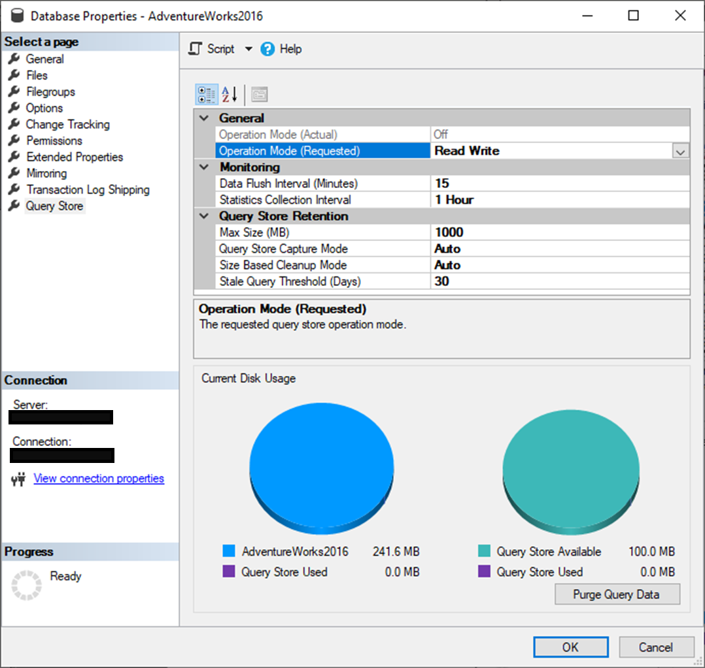

## Query Store demo

This demo shows capabilities of Query Store. Usually we demo 3-4 scenarios:
1.	How to turn on and initially configure Query Store
2.	How Query Store collects & exposed data
3.	Detecting and fixing query with plan choice regression
4.	Detecting and fixing workload that is candidate for auto-parametrization

## Prerequisites

Restore AdventureWorks2016_EXT database from the provided BAK at https://github.com/Microsoft/sql-server-samples/releases/tag/adventureworks.

After restoring the database AdventureWorks2016_EXT, go to Properties / Query Store tab, turn ON Query Store, and configure it according to best practices in https://docs.microsoft.com/sql/relational-databases/performance/best-practice-with-the-query-store.

 
Use docs content to walk through main config settings: https://docs.microsoft.com//sql/relational-databases/performance/best-practice-with-the-query-store#Configure 

### How Query Store Works
Open ShowBasics.sql script and execute queries individually:
-	Run simple `SELECT * FROM` Part
-	Show where query ends in sys.query_store_query_text, sys.query_store_query, sys.query_store_plan, sys.query_store_runtime_stats
-	Use custom view `vw_QueryStoreCompileInfo` to get info more easily. The main point here is: people can write their own scripts combining Query Store views
-	Execute the same user query from the proc, using sp_executesql, trigger and show that containing object defines query identity in QDS (each instance of the same query text becomes separate query that can be monitored and tuned independently) 
-	Show what happens with query that gets auto-parametrized. It cannot be searched using the original query text because QDS stores query as parametrized. Hopefully, sys.fn_stmt_sql_handle_from_sql_stmt can be used to track down query using original query text
-	Run `vw_QueryStoreRuntimeInfo` (again custom view) to show main runtime stats combined with query/plan info

### Query with plan regression
1.	Run QueryStoreSimpleDemo.exe with option R or option S
2.	Open SSMS, analyze and explain - two execution plans that SQL Server use alternately (switches between 2 plan almost randomly). This is known as Parameter Sniffing problem - plan gets generated based on parameter available at the compilation time. When compilation happens frequently and randomly and data is skewed (not all parameter values are uniformly distributed PSP is likely to occur and degradations are common)
3.	Force better plan, explain what happens (SSMS)
4.	Summarize benefits for DBA – fixing performance quickly without knowing details about the query. Fully transparent to running apps

### Detect and fix ad hoc workload that is candidate for parametrization
1.	Run QueryStoreSimpleDemo.exe with option P and let it work for some time (15-20 sec)
2.	Open “Auto-Param Analysis.sql” and run queries from groups (1) and (2). What we see is:
a.	Large number of queries / plan entries, small number of different query/plan hashes indicates queries that are not parametrized although they are good candidates
b.	Relatively big compile time shows that system wastes resources on compilation instead of execution
3.	Open SSMS Top Resource Consuming queries – if you increase number of presented queries to 50 you’ll see that majority of queries has similar /negligible consumption – there’s nothing user can optimize/tune. This is what we call “death by a thousand of cuts” 
4.	Run (3) query to see query text pattern – it becomes obvious that queries differ only by provided literal value
5.	If you run (1) you’ll notice that numbers do not change although workload is running. (4) gives us the answer – Query Store went to READ_ONLY due to large number of queries / plans. This is another point you should make: ad-hoc queries are not bad for SQL Server & execution but also for Query Store as it goes to RO mode which means we do not operate with latest facts!
6.	Run (5) to parametrize query and clear Query Store. Workload is still running!
7.	Run (1) again to see numbers now: ration between count(queries) and count(distinct query_hash) is now near to 1.
8.	Open Open SSMS Top Resource Consuming queries: you’ll see dozen of different queries to tune
9.	(6) show alternative solution – applying forced parametrization for the entire DB. Just mention, as a possible solution
10.	Run (7) to reset DB to  initial state.
