# Always Encrypted with secure enclaves 

This sample/demo showcases the benefits of [Always Encrypted with secure enclaves](https://aka.ms/AlwaysEncryptedwithSecureEnclaves).

## About this sample
- **Applies to:**  SQL Server 2019 CTP 2.1
- **Programming Language:** .NET C#, T-SQL
- **Authors:** Jakub Szymaszek [jaszymas-MSFT]

This project has adopted the [Microsoft Open Source Code of Conduct](http://microsoft.github.io/codeofconduct). For more information see the [Code of Conduct FAQ](http://microsoft.github.io/codeofconduct/faq.md) or contact [opencode@microsoft.com](mailto:opencode@microsoft.com) with any additional questions or comments. 

## Contents
1. [Prerequisites](#prerequisites) 
2. [Setup](#setup) 
3. [Demo Part 1 - Tour the Clinic database and the demo application](#demo-part-1---tour-the-clinic-database-and-the-demo-application)
4. [Demo Part 2 - Encrypt columns in place](#demo-part-2---encrypt-columns-in-place)
5. [Demo Part 3 - Run rich queries from SSMS](#Demo-Part-3---run-rich-queries-from-SSMS)
6. [Demo Part 4 - Re-encrypt and decrypt columns in-place](#demo-part-4---re-encrypt-and-decrypt-columns-in-place)
7. [Resetting your demo environment](#resetting-your-demo-environment)


## Prerequisites
You need two machines (they can be virtual machines):
- The SQL Server computer:
    + Windows Server 2019 Datacenter or Windows 10 Enterprise version 1809
    + SQL Server 2019 CTP 2.1 or later
    + [SQL Server Management Studio 18.0 or later](https://msdn.microsoft.com/en-us/library/mt238290.aspx) 
    + Visual Studio 2015 (or newer)
    + If this machine is a virtual machine, it must be a generation 2 VM.
- The HGS computer to host Windows Host Guardian Service for enclave attestation:
    + Windows Server 2019 Datacenter or Standard

## Setup
1. Configure host attestation for the SQL Server computer, following Steps 1-2 in [Tutorial: Getting started with Always Encrypted with secure enclaves using SSMS](https://aka.ms/AlwaysEncryptedEnclavesTutorial). 
1. Enable Always Encrypted with secure enclaves in your SQL Server instances by following instructions in Step 2 in [Tutorial: Getting started with Always Encrypted with secure enclaves using SSMS](https://aka.ms/AlwaysEncryptedEnclavesTutorial). 
1. Set up the Clinic demo database.
    + Clone/Download the repository.
	+ Open SSMS and connect to your SQL Server 2019 instance.
	+ In SSMS, right-click on **Databases** in Object Explorer and select **Import Data-tier Application...**. 
	+ Locate the **Clinic** bacpac file the **/setup** folder.  
    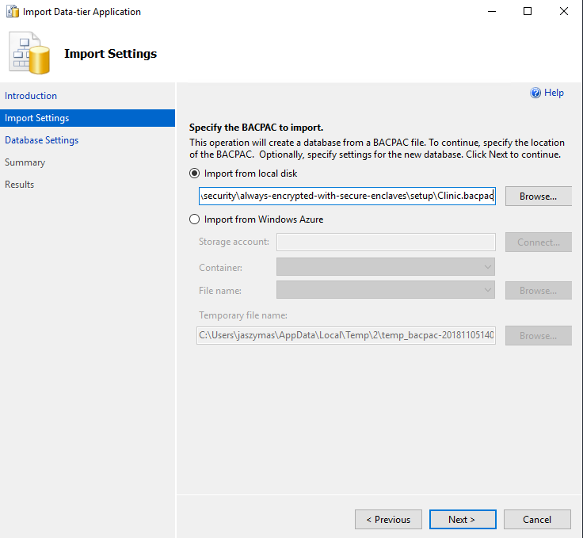
	+ Complete the steps of the wizard to import the **Clinic** database. 
1. Set up the database connection string in the demo application.
    + Start Visual Studio and open the **ContosoClinic** solution file- located in **/src**.
	+ Using Solution Explorer, locate and open the **web.config** file under the **ContosoClinic** project. 
	+ Look for the line that looks like this:
	```csharp 
	<connectionStrings>
	  <add name="DefaultConnection" connectionString="Data Source=.;Initial Catalog=Clinic; Integrated Security=true; Column Encrypteiond Setting = Enabled; Enclave Attestation URL=http://YourHGSComputer/Attestation"
	</connectionStrings>
	```
	+ Make sure the value of the **Data Source** key word in the database connection string is correct (identifies your instance). 
	+ Make sure the **Initial Catalog** value is set to **Clinic**
	+ Replace **YourHGSComputer** with a DNS name or an IP address of your HGS computer.
    + Save the file.

1. Build the demo application in Visual Studio.
    + Right click on your project in Solution Explorer and select **Properties**.
	+ Make sure the .NET Framework 4.7.2 or higher is configured as the target .NET Framework for your project (change it, if necessary).  
    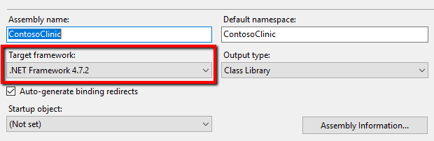
    + Build the solution.
	
## Demo Part 1 - tour the Clinic database and the demo application
1. Connect to your database using SSMS without Always Encrypted enabled in the database connection.
	- Open SSMS.
	- In the **Connect to Server** dialog, enter your server name and authentication parameters. For more information on using SSMS to connect to a Database, [click here](https://azure.microsoft.com/en-us/documentation/articles/sql-database-connect-query-ssms/).
	- Click the **Options >>** button and select the **Always Encrypted** tab. Make sure **Enable Always Encrypted** is not selected.  
	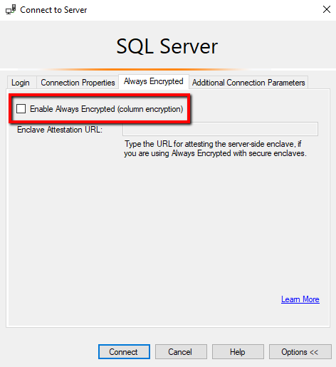
	-  Click **Connect**.
1. In SSMS, open and execute **tsql-scripts/ListAllPatients.sql**. The results of this query include sensitive information about patients: social security numbers, names, dates of birth, etc.
1. In SSMS, configure an extended event session,  you will use to monitor Transact-SQL queries the demo application sends to the database.
    - Open and execute **tsql-scripts/CreateXESession.sql**. This creates an extended event session,
	- In Object Explorer, locate the newly created **ClinicDemo** extended event session - under your server, go to **Management/Extended Events/Sessions**. 
	- Righ-click the **ClinicDemo** session and select **Watch Live Data**. This will open the **ClinicDemo Live Data** window.  
	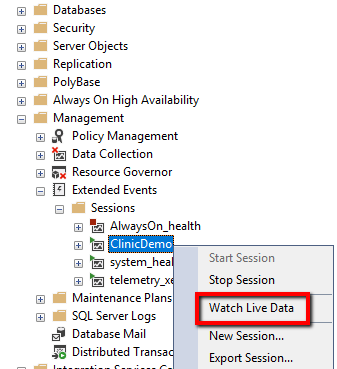
1. Run the demo application
    + In Visual Studio, start the app (**F5**). This will open the Contoso Clinic application in the default browser.
    + Select the **Patients** tab in the application.
    + Enter a part of a patient's name and the maximum patient age. You should see the patients that meet your search criteria.  
    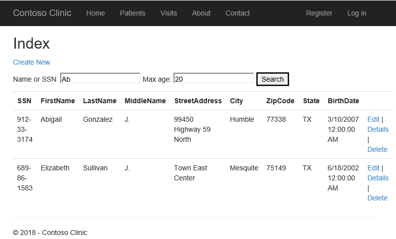
1. In SSMS, inspect the queries the demo application sends to the database.
    + Select the **ClinicDemo Live Data** window, which should contain a table with some events your demo application triggered.
    + If the table does not contain the **statement** column, right click on the header of the table and select **Choose Columns...**. Move **statement** to **Selected columns** and click **OK**.  
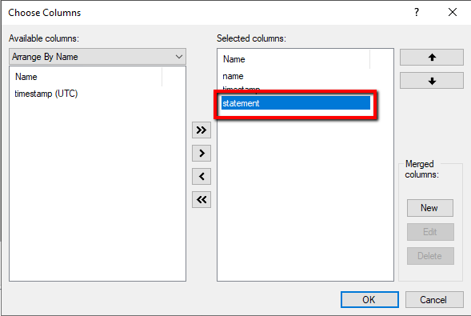
    + Back in the **ClinicDemo Live Data** window, double click on the statement column in the last row of the table to see the last query the application sent to the database. Inspect the query statement. Note the **WHERE** clause of the query contains the **LIKE** predicate on some string columns and a comparison (**>=**) on the **BirthDate** column.
    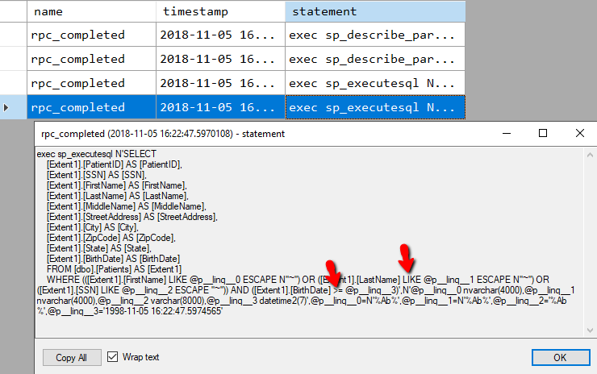
    + Click **OK** to close the statement window.

## Demo Part 2 - Encrypt columns in place
1. Connect to your database using SSMS with Always Encrypted enabled in the database connection.
	- Open a new instance of SSMS. (Keep the instance from the previous part of the demo open.)
	- In the **Connect to Server** dialog, enter your server name and authentication parameters. 
	- Click the **Options >>** button and select the **Always Encrypted** tab. Make sure **Enable Always Encrypted** is selected. Enter the URL of your enclave attestation service, you have configured when setting up your demo environment.
	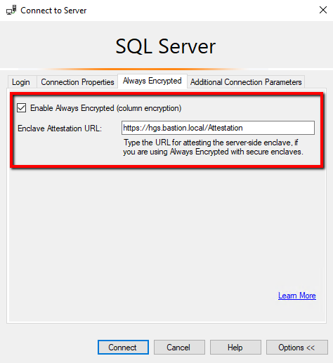  
	-  Click **Connect**.
1. Provision a column master key in SSMS.
    + In Object Explorer, expand your database and navigate to **Security/ Always Encrypted Keys/Column Master Keys**.  
    + Right-click on the **Column Master Keys** folder and select **New Column Master Key…**.
        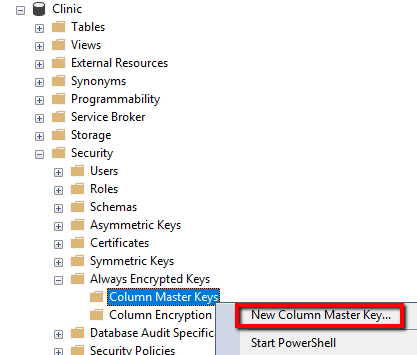
    + Enter a column master key name: **CMK1**.
    + Select **Windows Certificate Store - Current User**.
    + Make sure **Allow enclave computations** is selected.  
    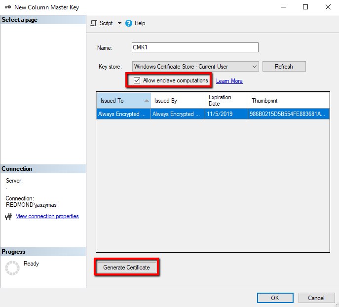
    + Click **Generate Certificate** to create a new certificate to be used as a column master key.
    + Click **OK**.
1. Provision a column encryption key.
    + In Object Explorer, expand your database and navigate to **Security/ Always Encrypted Keys/Column Encryption Keys**.
    + Right-click on the **Column Encryption Keys** folder and select **New Column Encryption Key…**.
    + Enter a column encryption key name: **CEK1**.
    + Select **CMK1** as the column master key to protect your new column encryption key.
    + Click **OK**.
1. Encrypt a few columns in-place using Transact-SQL.
    + In SSMS, open and review **tsql-scripts/EncryptColumns.sql**. Note the **ALTER TABLE ALTER COLUMN** statements that encrypt three columns: **SSN**, **LastName**, and **BirthDate**.  The statements also change the sort order of both string columns to **BIN2**, which is required to support rich queries on those columns.
    + Execute the script.
1. Check if the columns are encrypted.
    + Switch to the other instance of SSMS (from the previous part of the demo) that uses a database connection with Always Encrypted disabled.
    + Rerun the query from **tsql-scripts/ListAllPatients.sql**. Note that the data the **SSN**, **LastName**, **BirthDate** columns are now encrypted.  
    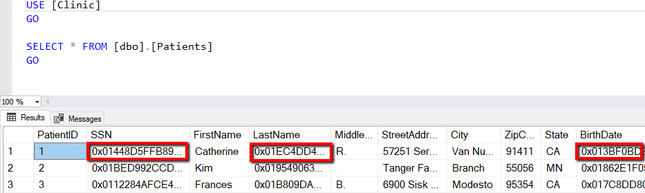
1. Test the Contoso Clinic web application.
    + In your web browser, refresh the **Patients** page in the Contoso Clinic application. Notice the application shows plaintext data. This is because Always Encrypted has been already configured in the database connection for the application in the **web.config** file.
    + Enter a part of a patient's name and the maximum patient age. You should see the patients that meet your search criteria.
	+ In SSMS, click on the **ClinicDemo Live Data** windows/tab, capturing extending events.
    + Double click on the statement column in the last row of the table to see the last query the application sent to the database. Note the query statement has not changed, but SQL Server now receives encrypted query parameters.
    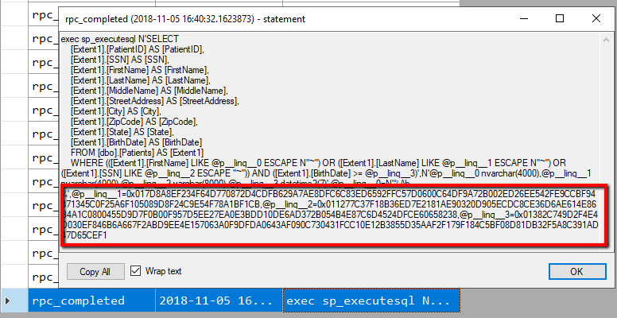
    + Click **OK** to close the statement window.

## Demo Part 3 - run rich queries from SSMS
1.  Enable Parameterization for Always Encrypted the SSMS instance that uses a database connection with Always Encrypted enabled. 
    + In the main menu, select **Tools** and then select **Options**
    + In the left pane of the **Options** window, navigate to **Query Execution/SQL Server/Advanced**. Scroll down in the right pane and make sure **Enabled Parameterization for Always Encrypted** is enabled.  
    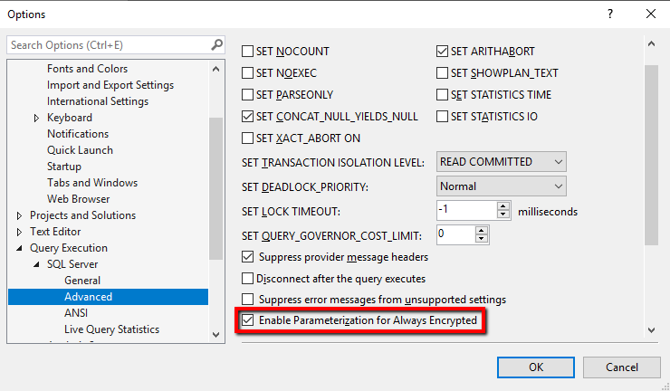
    + Click **OK**.
1. Open, review (change, if you want) and execute the query in **tsql-scripts/QueryColumns.sql**. The query should return the rows in the **Patients** table meeting the specified search criteria.

## Demo Part 4 - Re-encrypt and decrypt columns in-place
1.  Re-encrypt your columns to rotate/change the column encryption key.
    + In the SSMS instance that uses a database connection with Always Encrypted enabled, use Object Explorer to expand your database and navigate to **Security/ Always Encrypted Keys/Column Encryption Keys**.
    + Right-click on the **Column Encryption Keys** folder and select **New Column Encryption Key…**.
    + Enter a column encryption key name: **CEK2**.
    + Select **CMK1** as the column master key to protect your new column encryption key.
    + Click **OK** to provision a new column encryption key.
    + Open and review **tsql-scripts/RotateKeys.sql**. Note that the only difference between this script and **tsql-scripts/EncryptColumns.sql** is the column encryption key specified for the three columns (this script uses **CEK2**). When you execute the script, the columns are re-encrypted using the new column encryption key.
    + Refresh the demo app in the browser. The app should continue to work.
1.  Decrypt your columns (convert them back to plaintext).
    + Open, review and execute **tsql-scripts/DecryptColumns.sql**. This script decrypts the encrypted columns. It also re-sets the original collation of the columns.

## Resetting your demo environment
1.  Open and execute **tsql-scripts/DecryptColumns.sql**. 
1.  Open and execute **tsql-scripts/DropKeys.sql**. 
1.  Close both SSMS windows.