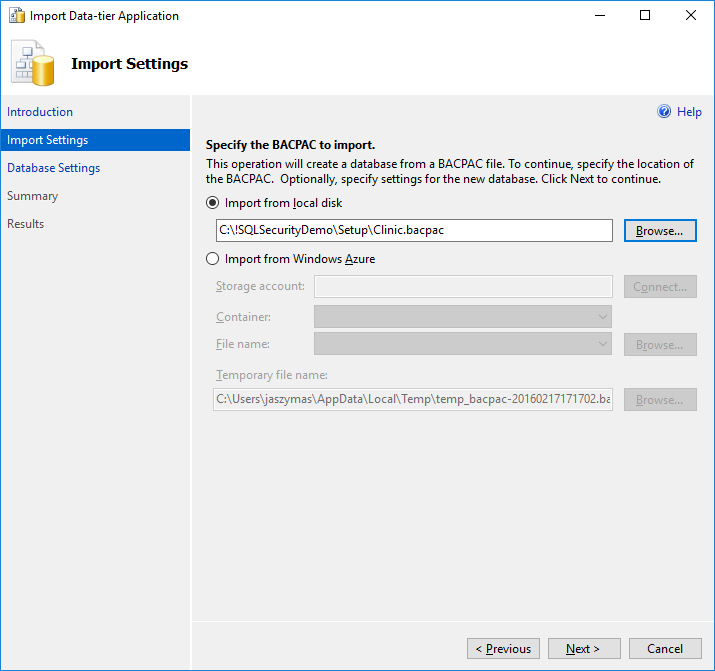
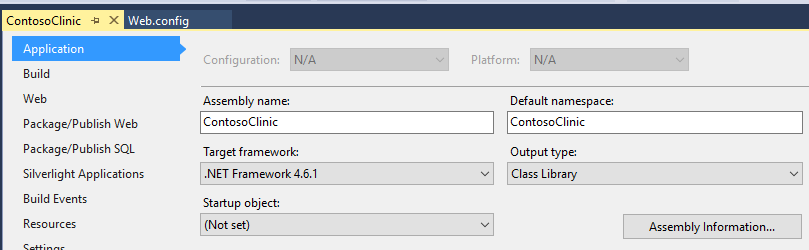
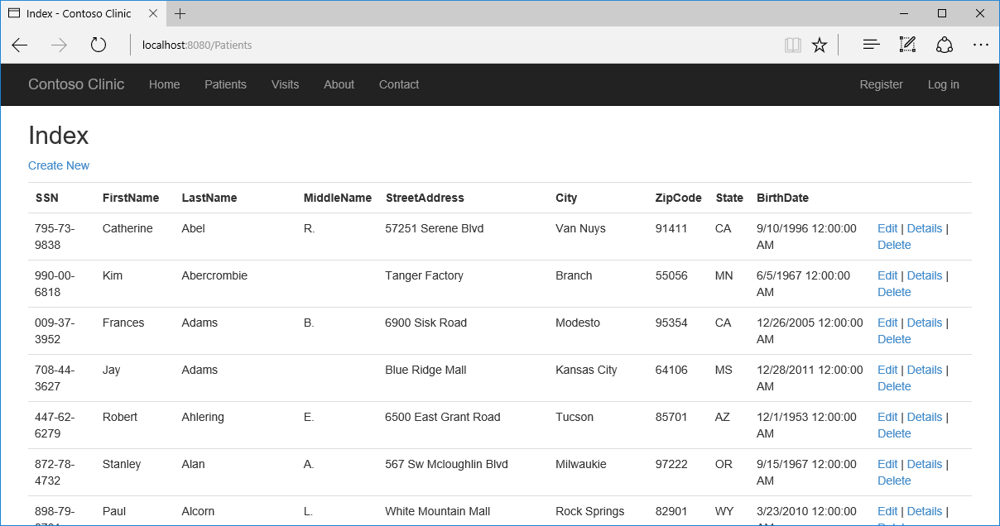
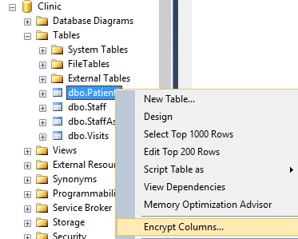
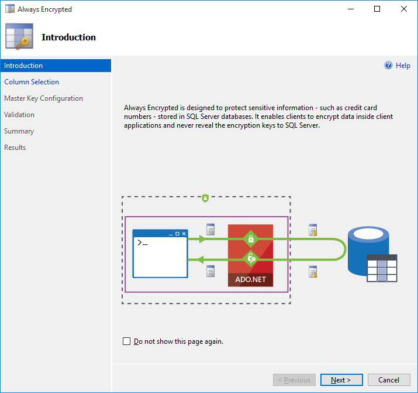
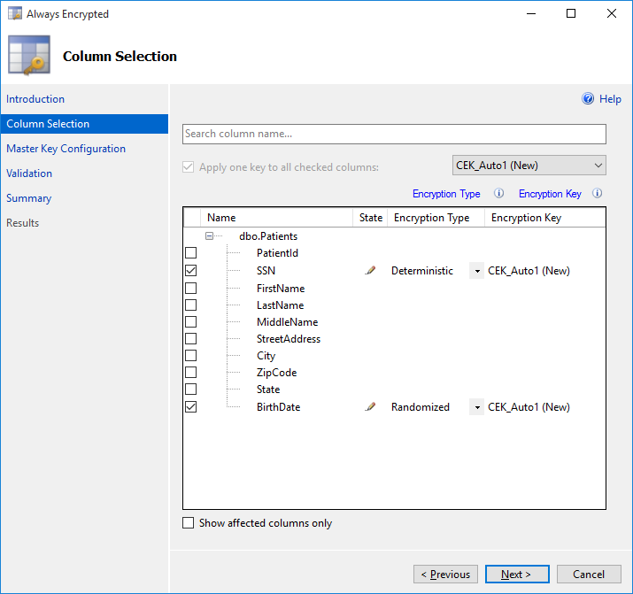
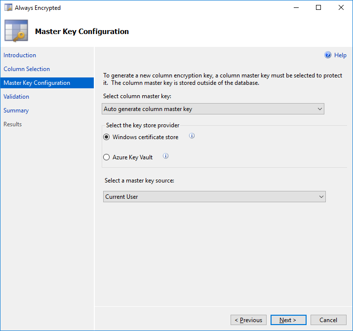
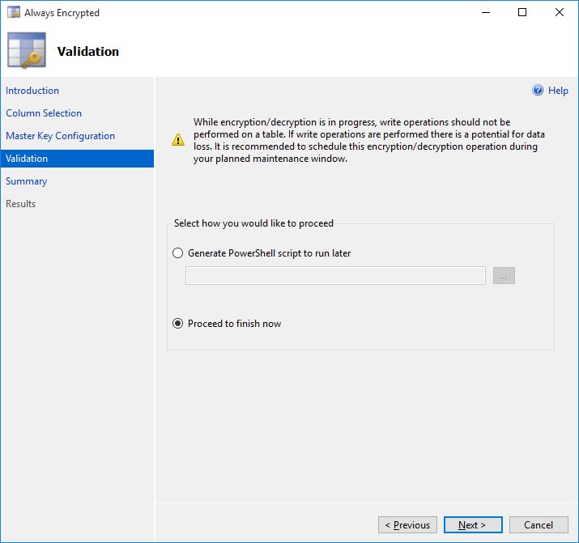
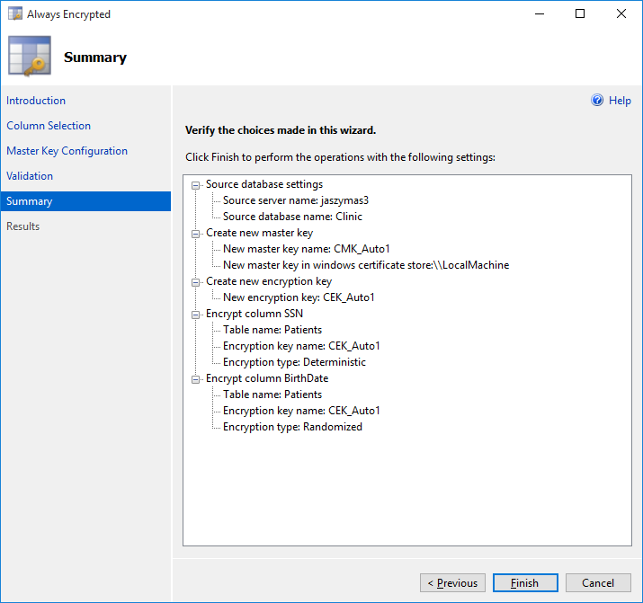
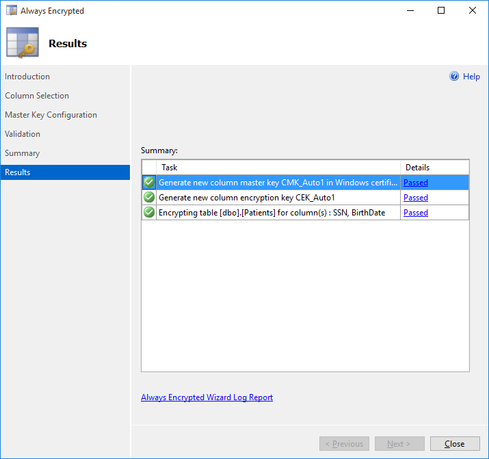

# Contoso Clinic Demo Application 

Sample application with database that showcases security features of SQL Server 2016. 

## About this sample
- **Applies to:**  SQL Server 2016
- **Programming Language:** .NET C#, T-SQL
- **Authors:** Jakub Szymaszek [jaszymas-MSFT]

This project has adopted the [Microsoft Open Source Code of Conduct](http://microsoft.github.io/codeofconduct). For more information see the [Code of Conduct FAQ](http://microsoft.github.io/codeofconduct/faq.md) or contact [opencode@microsoft.com](mailto:opencode@microsoft.com) with any additional questions or comments. 

## Contents
1. [Prerequisites](#prerequisites) 
2. [Setup](#setup) 
	* Set up the Demo Database
	* Modify the Sample Application
4. [SQL 2016 Security Features in this demo](#sql-2016-security-features-in-this-demo) 
	* Always Encrypted 
	* Row Level Security 
	* Dynamic Data Masking
5.  [Application Notes](#application-notes)


## Prerequisites
1. Visual Studio 2015 (or newer)
2. [SQL Server 2016](https://www.microsoft.com/en-us/evalcenter/evaluate-sql-server-2016) 
3. [SQL Server Management Studio](https://msdn.microsoft.com/en-us/library/mt238290.aspx) 

## Setup
### Set up the Demo Database
1. Clone/Download the repository
2. Import the *Clinic* database
	+ Open SSMS and connect to your SQL Server 2016 instance
	+ In SSMS, right-click on *Databases* in Object Explorer and select *Import Data-tier Application...*. 
	+ Locate your copy of the bacpac file, located in the */setup* folder. 
	
	+ Complete the steps of the wizard. 
3. While connected to your database (master) via SSMS, execute [setup/Create-Application-Login.sql](setup/Create-Application-Login.sql) link.
	+ Before running the script, create a password for the `ContosoClinicApplicaation` user.  
	+ This script creates a login and user, assigns `datareader` and `datawriter` permissions, and gives several Always Encrypted specific permissions to the `ContosoClinicApplication` user 

### Modify and Set up the Sample Application Project
1. Start Visual Studio and open the Contoso Application solution file- located in /src. 
2. Modify the connection string in the demo web app. 
 
	+ Using Solution Explorer, locate and open the web.config file under the ContosoClinic project. 
	+ Look for the line that looks like this:
	```csharp 
	<connectionStrings>
	  <add name="DefaultConnection" connectionString="Data Source=youserver;Initial Catalog=Clinic;
	  User ID=ContosoClinicApplication;Password=yourpassword" providerName="System.Data.SqlClient" />
    	<!--
    	To enable Always Encrypted, add the following to the connection string: Column Encryption Setting=Enabled
	 -->
	 </connectionStrings>
	```
	+ Update the value of the *Data Source* key word in the database connection string to denote your server 
	+ Make sure the *password* for your application users is correct (matches the password that you configured earlier)
	+ Make sure the *Initial Catalog* value is set to *Clinic*
	+ Save the file

3. Make sure the .NET Framework 4.6.1 or higher is configured as the target .NET Framework for your project. 

	+ Right click on your project in Solution Explorer and select *Properties*
	+  Verify the value of the Target framework property is correct (change it, if necessary) 
	

4. Test the Demo Setup
	+ Run the ContosoClinic application from Visual Studio (by hitting *F5* OR select *Debug* > *Start Debugging*). This will compile the solution and open the application in your default web browser. 
	+ Click on the *Patients* tab. You should see a list of patients. 
	
	+ Click *Edit* for one of the patients, change patient's SSN and click *Save*. The updated SSN should show up in the list of patients. 
	+ You are now ready to demo the security features described below. 
	
## SQL 2016 Security Features in this Demo
### Always Encrypted 
#### Enable Always Encrypted
+ Connect to your database using SSMS: 
	- For more information on using SSMS to connect to a Database, [click here](https://azure.microsoft.com/en-us/documentation/articles/sql-database-connect-query-ssms/)
+ Encrypt Sensitive Data Columns using the Column Encryption Wizard 
	- Right click on the **Patients** table in the **Clinic** database and select **Encrypt Columns...**
	  
	- The Column Encryption wizard will open. Click **Next**.
	 
	- Select the **SSN** and **BirthDate** columns. 
		* Select **Deterministic Encryption** for **SSN** as the application needs to be able to search patients by SSN; Deterministic Encryption preserves that functionality for our app without leaving data exposed. 
		* Select **Randomized Encryption** for **BirthDate** 
	
	- Leave **CEK_Auto1 (New)** as the Key for both columns. Click **Next**.
	- On the **Master Key Configuration** page, the Master Key Source should default to to **Windows Certificate Store**, with the **Master Key Source** defaulted to **Current User**. (This will store the key on your local machine.)
	
	- Click the **Next** button on the Validation page.
	
	- The Summary Page provides an overview of the settings we selected. Click **Finish**.
	
	- Monitor the progress of the wizard; once finished, click **Close**.
	
+ View the data in SSMS (in SSMS use: `SELECT SSN, BirthDate FROM dbo.Patients` or `SELECT * FROM dbo.Patients` ) 
	- Note that the data is now encrypted on the server for both the **SSN** and **BirthDate** columns. 
+ Navigate to or refresh the /patients page
	- Notice that the application now throws an exception. 
	- This was expected as the application driver does not know how to handle the encrypted data.
	- We designed this web app to have a type mismatch, but more flexible webpage design would expose the encrypted value. 
+ Configure the web app to use Always Encrypted 
	- Stop the web app (close the window/ or click *Stop Debugging*) 
	- Using the Solution Explorer of Visual Studio, locate and open the web.config file under the ContosoClinic project. 
	- Look for the connection string, and add `Column Encryption Setting=Enabled` to the end of the connection string so that it reads like this:
	```csharp 
	<add name="DefaultConnection" connectionString="Data Source=.;Initial Catalog=Clinic;User
	ID=ContosoClinicApplication;Password={Some Strong Password};Column Encryption Setting=Enabled"
	providerName="System.Data.SqlClient" />
	```
	- Run the ContosoClinic application from Visual Studio (by hitting *F5* OR select *Debug* > *Start Debugging*)
	- Click on the *Patients* tab. You should see a list of patients again. 

#### How did that work? 
##### Connection String
Our connection string for our application now contains `Column Encryption Setting=Enabled` which instructs the driver to automatically encrypt parameters targeting encrypted columns and decrypt any results retrieved from encrypted columns, without code changes. Don't forget this for your app if you intend to use Always Encrypted functonality. For more information this feature, [see our blog](https://blogs.msdn.microsoft.com/sqlsecurity/2016/07/11/always-encrypted-in-azure-sql-database-is-generally-available/). 

### Row Level Security (RLS) 

#### Login to the application 
Sign in using (Rachel@contoso.com/Password1!) or (alice@contoso.com/Password1!)

#### Enable Row Level Security (RLS) 
+ Connect to your database using SSMS: 
[Instructions](https://azure.microsoft.com/en-us/documentation/articles/sql-database-connect-query-ssms/)
+ Open Enable-RLS.sql ( [Find it here](tsql-scripts/Enable-RLS.sql))
+ Execute the commands 
+ Observe the changes to the results returned on the /visits or /patients page

#### How did that work? 

##### The application leverages an Entity Framework feature called **interceptors** 
Specifically, we used a `DbConnectionInterceptor`. The `Opened()` function is called whenever Entity Framework opens a connection and we set SESSION_CONTEXT with the current application `UserId` there. 

##### Predicate functions
The predicate functions we created in Enable-RLS.sql identify users by the `UserId` which was set by our interceptor whenever a connection is established from the application. The two types of predicates we created were **Filter** and **Block**. 
+ **Filter** predicates silently filter `SELECT`, `UPDATE`, and `DELETE` operations to exclude rows that do not satisfy the predicate. 
+ **Block** predicates explicitly block (throw errors) on `INSERT`, `UPDATE`, and `DELETE` operations that do not satisfy the predicate. 

### Dynamic Data Masking

#### Enable Dynamic Data Masking
+ Navigate to the /patients page
+ Connect to your deployed database using SSMS: [Instructions](https://azure.microsoft.com/en-us/documentation/articles/sql-database-connect-query-ssms/)
+ Open Enable-DDM.sql ([Find it here](tsql-scripts/Enable-DDM.sql)) 
+ Execute the commands
+ Observe the changes in results returned on the /visits page

#### How did that work? 
Dynamic data masking limits sensitive data exposure by masking the data according to policies defined on the database level while the data in the database remains unchanged; this is based on the database user's permissions. Those with the `UNMASK` permission will 
have the ability to see the data without masks. In our case, the application's database login did not have the `UNMASK` permission and saw the data as masked. For your administrator login, the data was visible, as the user had the `UNMASK` permission. For more information on Dynamic Data Masking, [see the documentation](https://msdn.microsoft.com/en-us/library/mt130841.aspx). 

## Application Notes
The code included in this sample is only intended to provide a simple demo platform for users to enable and gain experience with SQL Server 2016 security features; the demo web app is not intended to hold sensitive data and should not be used as a reference for applications that use or store sensitive data. Please take adequate steps to securely develop your application and store your data.  
