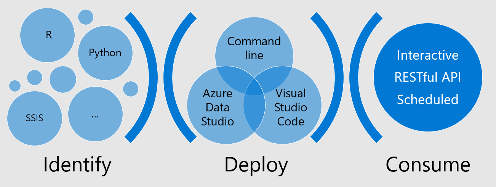

# Application deployment on SQL Server big data cluster

## Build more intelligent apps
Application deployment allows you to deploy applications into SQL Server big data cluster as containers. These apps are hosted for you and exposed as Swagger compliant web services for usage in your application. The apps you deploy have access to the data stored in the big data cluster and can be monitored easily. For more information, see [How to deploy and app on SQL Server 2019 big data cluster (preview)](https://docs.microsoft.com/en-us/sql/big-data-cluster/big-data-cluster-create-apps?view=sqlallproducts-allversions). This page provides a number of samples for different technology stacks.

## Pre-requisites
* SQL Server big data cluster CTP 2.3 or later
* `mssqlctl` CLI familiarity. If you are unfamiliar with `mssqlctl` please refer to - [App Deployment in SQL Server big data cluster](https://docs.microsoft.com/en-us/sql/big-data-cluster/big-data-cluster-create-apps?view=sqlallproducts-allversions) for more information.

* Tip 
**mssqlctl app -h** will display the various commands to manage the app

## Templates
Templates are used by our [App Deploy add-ins](https://docs.microsoft.com/en-us/sql/big-data-cluster/app-deployment-extension?view=sqlallproducts-allversions) and can be used to quickly deploy applications.
> Looking for our templates? See [the SQLBDC-AppDeploy repo](https://github.com/Microsoft/SQLBDC-AppDeploy).

## Available samples
### Python 
These samples demonstrates how you can deploy a simple Python app into SQL Server big data cluster as container app as web service that is swagger compliant for building your application.

|Sample|Description|
|-|-|
|__[addpy](addpy/)__|This sample takes two numbers and returns the sum. This sample also has detailed instructions on how to call apps through a RESTful web service.|
|__[magic8ball](magic8ball/)__|Runs a [Magic 8-Ball](https://en.wikipedia.org/wiki/Magic_8-Ball)|

### R 
These samples demonstrates how you can deploy a simple R app into SQL Server big data cluster as container app as web service that is swagger compliant for building your application. 

|Sample|Description|
|-|-|
|__[RollDice](RollDice/)__|This sample demonstrates the use of data frames by rolling dices|
|__[sentiment-analysis](sentiment-analysis)__|Demonstrates how to run a sentiment analysis on a pre-trained model|
|__[sumofsq](sumofsq/)__|Returns the sum of squares of two input numbers|

### MLeap 

|Sample|Description|
|-|-|
|__[mleap](mleap/)__|This sample demonstrates how you use a MLeap bundle (a Spark model serialized in this format) and run it outside of Spark. The sample is based on the MLeap sample available here http://mleap-docs.combust.ml/mleap-serving/. We are using the MLeap Serving container that is published in Docker Hub. The MLeap Serving is deployed as container in SQL Server big data cluster as a container app with a web service that takes the Leap Frame as the input.|

### Sql Server Integration Services 

|Sample|Description|
|-|-|
|__[SSIS](SSIS/)__|This sample demonstrates how you can run SSIS applications as a containerized application leveraging the cron capability in Kubernetes. This example uses a Data Transformation Services Package File Format (DTSX) file developed using Visual Studio that, when executed, takes a database backup. This will run as a cron job which creates the backups every minute. Please follow the `README.md` for detailed instructions.|

## Related Links
For more information, see these articles:

[How to deploy and app on SQL Server 2019 big data cluster (preview)](https://docs.microsoft.com/en-us/sql/big-data-cluster/big-data-cluster-create-apps?view=sqlallproducts-allversions)