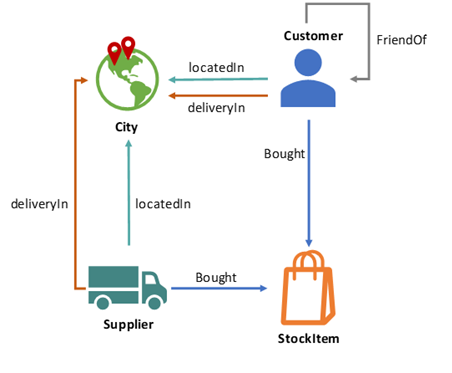

# Derived Tables and Views in Graph Match Queries
SQL Server (starting with SQL Server 2017) and Azure SQL Database now let you create a graph database, to hold your entities and complex many to many relationships. There are several examples on github which demonstrate how the new graph features work. This example shows how you can use derived tables and views created on graph node or edge tables in graph match queries. This feature is in public preview on Azure SQL Database and SQL Server 2019 CTP2.1.

 
To demonstrate the functionality, we will be using WideWorldImporters as our sample database.  

## Contents
[About this sample](#about-this-sample) 
[Before you begin](#before-you-begin) 
[Run this sample](#run-this-sample) 
[Related links](#related-links)

## About this sample
1.  **Applies to:**
    -   Azure SQL Database v12 (or higher)
    -   SQL Server 2019 CTP2.1 (or higher)
2.  **Demos:**
    -   Build and populate graph node and edge tables
    -   Use derived tables and views in graph match queries. 
3.  **Workload:**  Queries executed on  [WideWorldImporters](https://github.com/Microsoft/sql-server-samples/releases/tag/wide-world-importers-v1.0)
4.  **Programming Language:**  T-SQL
5.  **Author:**  Shreya Verma

## Before you begin
To run these demo scripts, you need the following prerequisites.

**Account and Software prerequisites:**

1.  Either
    -   Azure SQL Database v12 (or higher)
    -   SQL Server 2019 CTP2.1 (or higher)
2.  SQL Server Management Studio 17.x (or higher)

**Azure prerequisites:**

1.  An Azure subscription. If you don't already have an Azure subscription, you can get one for free here:  [get Azure free trial](https://azure.microsoft.com/en-us/free/)
    
2.  When your Azure subscription is ready to use, you have to create an Azure SQL Database, to do that, you must have completed the first three steps explained in  [Design your first Azure SQL database](https://docs.microsoft.com/en-us/azure/sql-database/sql-database-design-first-database)

## Run This Sample

### Setup
#### Azure SQL Database Setup

1.  Download the  **WideWorldImporters-Standard.bacpac**  from the WideWorldImporters database  [page](https://github.com/Microsoft/sql-server-samples/releases/tag/wide-world-importers-v1.0)
    
2.  Import the  **WideWorldImporters-Standard.bacpac**  bacpac file to your Azure subscription. [This document](https://docs.microsoft.com/en-us/azure/sql-database/sql-database-import) describes how you can restore a bacpac file to your Azure SQL Database.
    
3.  Launch SQL Server Management Studio and connect to the newly created WideWorldImporters database
    

#### SQL Server Setup

1.  Download  [**WideWorldImporters-Full.bak**](https://github.com/Microsoft/sql-server-samples/releases/tag/wide-world-importers-v1.0)
    
2.  Launch SQL Server Management Studio, connect to your SQL Server instance (2017) and restore  **WideWorldImporters-Full.bak**.  This document describes how to [Restore a Database Backup Using SSMS](https://docs.microsoft.com/en-us/sql/relational-databases/backup-restore/restore-a-database-backup-using-ssms). 

#### Running the Sample Scripts
1. Once the database is restored, run the *setup-wwi-graph.sql* script to create the necessary graph node and edge tables. We will be using these tables to run our sample queries. The setup file creates the following graph schema

2. Run the *DerivedTablesAndViewsInGraphMatch.sql* script to create derived tables and views on nodes and edges, that can be then used in graph match queries to generate insights. The script demonstrates:

 1. How to query heterogeneous edges in match query.
 2. How to query heterogeneous nodes in match query.
 3. How to query heterogeneous nodes and edges in match query. 
 
## Related Links

For more information about Graph DB in SQL Server 2017, see these articles:

1.  [Graph processing with SQL Server and Azure SQL Database](https://docs.microsoft.com/en-us/sql/relational-databases/graphs/sql-graph-overview)
    
2.  [SQL Graph Architecture](https://docs.microsoft.com/en-us/sql/relational-databases/graphs/sql-graph-architecture)
    
3.  [Using MATCH in MERGE DML](https://blogs.msdn.microsoft.com/sqlserverstorageengine/2018/07/16/match-support-in-merge-dml-for-graph-tables/)
4.  [Edge Constraints on graph tables](https://blogs.msdn.microsoft.com/sqlserverstorageengine/2018/09/28/public-preview-of-graph-edge-constraints-on-sql-server-2019/)

