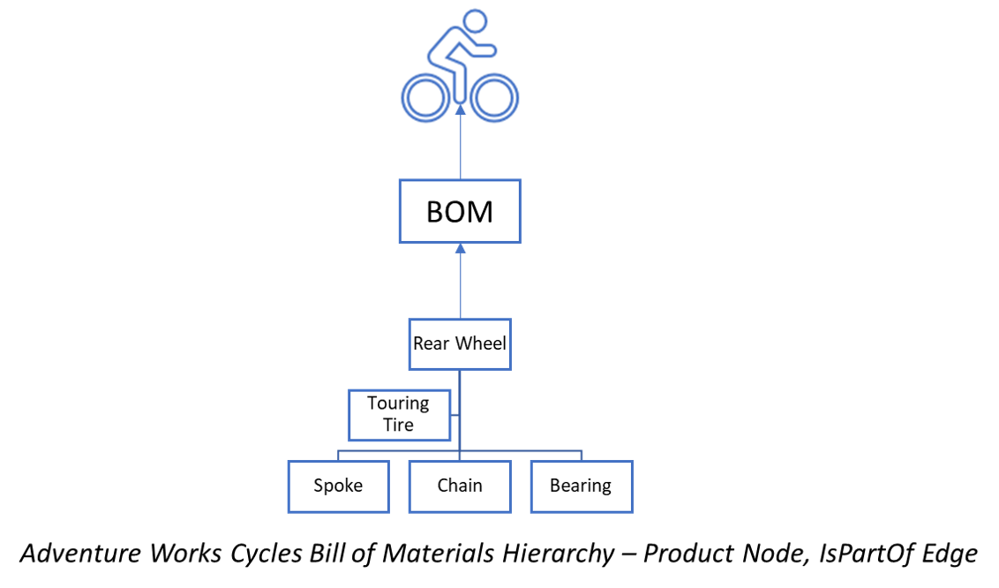

# SHORTEST_PATH 
SQL Server (starting with SQL Server 2017) and Azure SQL Database now let you create a graph database, to hold your entities and complex many to many relationships. There are several examples on github which demonstrate how the new graph features work. This example shows how you can use SHORTEST_PATH function to write a shortest path or arbitrary length traversal query. This feature is available for public preview with SQL Server 2019 CTP3.1

 
To demonstrate the functionality, we will be using AdventureWorks2014 as our sample database.  

## Contents
[About this sample](#about-this-sample) 
[Before you begin](#before-you-begin) 
[Run this sample](#run-this-sample) 
[Related links](#related-links)

## About this sample
1.  **Applies to:**
    -   SQL Server 2019 CTP3.1 (or higher)
2.  **Demos:**
    -   Build and populate graph node and edge tables
    -   Use SHORTEST_PATH function to compute shortest path 
        - between 2 given nodes.
        - starting from a given node to all other nodes in the graph.
        - starting from a given node to all other nodes, which are 1 to 3 hops away from the start node.
3.  **Workload:**  Queries executed on  [AdventureWorks2014](https://github.com/Microsoft/sql-server-samples/releases/download/adventureworks/AdventureWorks2014.bak)
4.  **Programming Language:**  T-SQL
5.  **Author:**  Shreya Verma

## Before you begin
To run these demo scripts, you need the following prerequisites.

**Account and Software prerequisites:**

1.  SQL Server 2019 CTP3.1 (or higher)
2.  SQL Server Management Studio 18.x (or higher)

## Run This Sample

### Setup

#### SQL Server Setup

1.  Download  [**AdventureWorks2014.bak**](https://github.com/Microsoft/sql-server-samples/releases/download/adventureworks/AdventureWorks2014.bak)
    
2.  Launch SQL Server Management Studio, connect to your SQL Server instance (2019) and restore  **AdventureWorks2014.bak**.  This document describes how to [Restore a Database Backup Using SSMS](https://docs.microsoft.com/en-us/sql/relational-databases/backup-restore/restore-a-database-backup-using-ssms). 

#### Running the Sample Scripts
1. Once the database is restored, run the *setup-BOMGraph.sql* script to create the necessary graph node and edge tables. We will be using these tables to run our sample queries. The setup file creates Product node table and IsPartOf edge table, which represents the BOM for products in AdventureWorks Cycles manufacturing pipeline. 

2. Run the *ShortestPath.sql* script to run some SHORTEST_PATH queries. The script has following example queries:
    1. Starting from a given node, find shortest path to all the other nodes in the graph.
    2. Starting from a given node, find shortest path to all the other nodes in the graph, which are 1 -3 hops away from the start node.
    3. Find shortest path between 2 given nodes (start and end node)
    
 
## Related Links

For more information about Graph DB in SQL Server 2017, see these articles:

1.  [Graph processing with SQL Server and Azure SQL Database](https://docs.microsoft.com/en-us/sql/relational-databases/graphs/sql-graph-overview)
    
2.  [SQL Graph Architecture](https://docs.microsoft.com/en-us/sql/relational-databases/graphs/sql-graph-architecture)
    
3.  [Using MATCH in MERGE DML](https://blogs.msdn.microsoft.com/sqlserverstorageengine/2018/07/16/match-support-in-merge-dml-for-graph-tables/)
4.  [Edge Constraints on graph tables](https://blogs.msdn.microsoft.com/sqlserverstorageengine/2018/09/28/public-preview-of-graph-edge-constraints-on-sql-server-2019/)

