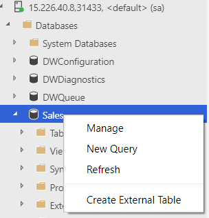
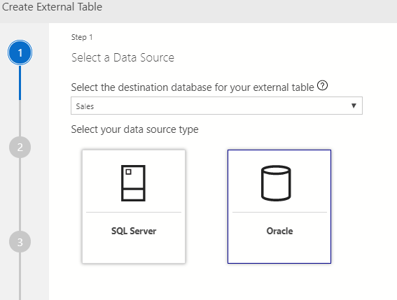
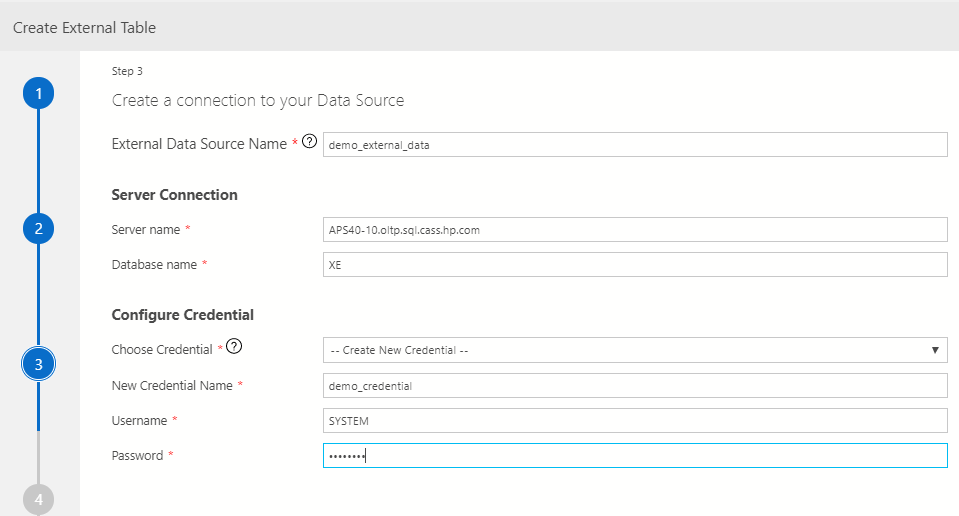
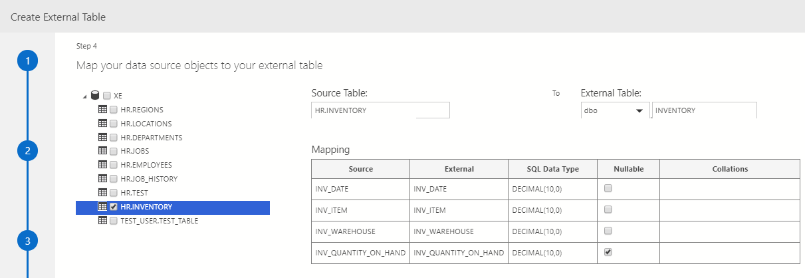

# WRK3010 Powering AI by integrating SQL Server with big data and other data sources

In this workshop you will get hands on integrating data in SQL Server with big data to power your AI and analytics.  SQL Server 2019 enables you to easily to integrate SQL Server with different types of data sources including big data.  Integrating data sources like this improves the velocity, veracity, volume, and variety of the data that you are feeding into AI.  You will learn how you can use Machine Learning Services directly in SQL Server to train, store, and operationalize your models.  You’ll get a chance to use some of the new features of SQL Server 2019 like  big data clusters!

## Setup
Scenarios in this lab are using a SQL Server big data cluster that is already provisioned for you on top of a Kubernetes cluster running in an HP Enterprise datacenter (Thanks for the partnership HPE!).

For interacting with the cluster and run through the data scenarios below, you will use Azure Data Studio and the newly released SQL Server 2019 preview extension. Azure Data Studio and the SQL Server 2019 preview extension are already installed on your VM.

The data virtualization scenario uses an Oracle server that is already provisioned.

*Sales* database is already restored on the SQL Server master instance for you to use as sample database. Other sample scripts and notebooks are stored in HDFS, in the SQL Server big data cluster. 

>**!!! IMPORTANT !!!**
For the examples below, you will have to save the *.sql* scripts and the notebook file on your local VM, open the local copy, connect to the SQL Server Master or Knox/HDFS gateway and run the script/notebook step by step.

Before starting the workshop, validate you can connect to all SQL Server big data cluster endpoints. Passwords will be provided by your proctor.
-	SQL Server Master – using Azure Data Studio -> New Connection -> Connection type “Microsoft SQL Server” -> Host: 15.226.40.8,31433 -> User: sa/Password: xxxxxxx
-	HDFS/Spark gateway – using Azure Data Studio -> New Connection -> Connection type “SQL Server big data cluster” -> Host: 15.226.40.8 -> User: root/Password: xxxxxxxx

## 1. Data ingestion using Spark streaming
SQL Server Big Data clusters provide scale-out compute and storage to improve the performance of analyzing any data. Data from a variety of sources can be ingested and distributed across data pool instances for analysis.
In this example, you are going to use Spark to read and transform data from HDFS and cache it in data pools. Querying the external table created over this aggregated data stored in data pools will be much more efficient.  

### Instructions
Using Azure Data Studio, connect to HDFS/SPARK gateway, save locally on your VM the *data_ingestion_using_spark_streaming.sql* script located in HDFS under *sql_scripts* folder. Open the local copy of your script and follow instructions in the script to:

1. Connect to SQL Server Master (*sales* database) using Azure Data Studio
2. Create an external table using the SQL script.  Make sure you rename the table throughout the script to something unique.
3. Create and submit a Spark job that ingests data from HDFS into the external table

    This object is used for starting spark streaming session using spark-submit
    
    The arguments to jar file are:

    1. server name - sql server to connect to read the table schema
    2. port number 
    3. username - sql server username for master instance
    4. password - sql server password for master instance
    5. database name
    6. external table name
    7. Source directory for streaming. This must be a full URI - such as "hdfs:///clickstream_data"
    8. Input format. This can be "csv", "parquet", "json".
    9. enable checkpoint: true or false

    Submit spark job with below parameters. You can use the Spark submit experience from Azure Data Studio (right click on big data cluster server name-> Submit Spark Job):

    ARGUMENTS:
    
    **job name:** yourJobName

    **switch** from "Local" to "HDFS"
    
    **Path to jar** (copy/paste this):

    /jar/mssql-spark-lib-assembly-1.0.jar

    **Main class:**
    FileStreaming

    **Parameters (copy/paste this; make sure you replace the password and table name!):**
    

    mssql-master-pool-0.service-master-pool 1433 sa passwordHere sales yourTableNameHere hdfs:///clickstream_data csv false 

4. Query external table using the SELECT queries in the  to see data coming from the streaming job
   
## 2. Data ingestion using SQL stored proc
This scenario is similar to the above Spark sample. If you are more familiar with using TSQL, you can use your preferred query language to achieve the same performance enhancements leveraging data pools in SQL Server Big Data clusters.

### Instructions
Using Azure Data Studio, connect to HDFS/SPARK gateway, save locally on your VM a local copy of the  *data_ingestion_using_sql_store_proc.sql* script located in HDFS under *sql_scripts* folder. Follow instructions in the script to:

1. Connect to SQL Server Master (*sales* database) using Azure Data Studio
2. Create external table
3. Call sp_data_pool_table_insert_data to insert data from web_clickstreams table into the external table
4. Query external table
5. Cleanup 

## 3. Query HDFS data using SQL Server Master
In SQL Server 2019 big data clusters, the SQL Server engine has gained the ability to natively read HDFS files, such as CSV and parquet files, by using SQL Server instances collocated on each of the HDFS data nodes to filter and aggregate data locally in parallel across all of the HDFS data nodes.
In this example, you are going to create an external table in SQL Server Master instance that points to data in HDFS within the SQL Server Big data cluster. Then you will join the data in the external table with high value data in SQL Master instance.

### Instructions
Using Azure Data Studio, connect to HDFS/SPARK gateway, save locally on your VM a local copy of the  *data_virtualization_HDFS.sql* script located in HDFS under *sql_scripts* folder. Follow instructions in the script to:

1. Connect to SQL Server Master (*sales* database) using Azure Data Studio
1. Create external table
1. Run query to join data in external table with high value data
1. Cleanup 

## 4. Create external table over Oracle database
By leveraging SQL Server Polybase technologies, SQL Server Big Data clusters can query external data sources without importing the data in SQL Server. SQL Server 2019 preview introduces new connectors to data sources like Oracle, MongoDB or Teradata. In this example, you are going to create an external table in SQL Server Master instance over the inventory table that sits on an Oracle server.

### Instructions

*Option# 1*

1. Using Azure Data Studio, connect to SQL Server Master *sales* database-> Right click on database name-> Create external table

2. In the “Select a data source” dialog, choose “Oracle” as external data source type, then click “Next”:

3. In the next step, create a database master key for database *sales*. If the database already has a master key, the input is greyed out and you just click “Next”.
4. In the “Create a connection to your data source” dialog, you are configuring the external data source, including the name (you can use any **_unique_** name for the external data source), the server/database name of the Oracle data source, as well as the credentials to access authenticate to it (you can use any **_unique_** name for the credential). You are going to use a pre-provisioned Oracle server: **APS40-10.oltp.sql.cass.hp.com** (database: **XE**; username: **SYSTEM**; password: **Admin123**).

5. In the “Map your data source objects to your external table” dialog, select the HR.INVENTORY table (you must mark the checkbox next to the table name _and_ select the table name so the table name is highlighted as below) and map its columns and types to columns and types in the SQL server external table:

> !! IMPORTANT !!  Make sure you use a **unique** table name for the external table name.
> 

6. In the final summary dialog, click “Create” to complete the external table creation.
7. Query external table
8. Connect to HDFS/SPARK gateway, save locally and open the local copy of the *query_external_table_over_Oracle.sql* script located in HDFS under *sql_scripts* folder. Follow the instructions in the script to run a query that joins the inventory data from the external table with the high value data in the SQL Server Master *sales* database.
9. Run the cleanup step from the above script to remove the database objects you created for this example.

*Option# 2*

Same scenario can be achieved using TSQL script. Connect to HDFS/SPARK gateway, “Preview”, save locally and open the local copy of the *data_virtualization_oracle.sql* script located in HDFS under *sql_scripts* folder. Follow instructions in the script to:

1. Connect to SQL Server Master (*sales* database) using Azure Data Studio
1. Create an external data source and an external table in sales database that points to inventory table on Oracle server
1. Query external table
1. Connect to HDFS/SPARK gateway, “Preview”, save locally and open the local copy of the *query_external_table_over_Oracle.sql* script located in HDFS under *sql_scripts* folder. Follow the instructions in the script to run a query that joins the inventory data from the external table with the high value data in the SQL Server Master sales database.
1. Run the cleanup step from the above script to remove the database objects you created for this example.

## 5. Run Notebooks to query data in HDFS
The new built-in notebooks in Azure Data Studio are enabling data scientists and engineers to write Python, R, or Scala code before submitting the code as Spark jobs and viewing the results inline. Notebooks facilitate collaboration between teammates working on a data analysis project together.

### Instructions
In this example, you are going to run a sample notebook that analyzes the data over a diabetes dataset publicly available, and try to infer the different patterns that influence the outcome of diabetes. 

1. Connect to HDFS/Spark gateway and locate *Cluster_Diabetes_Demo.ipynb* file under *notebooks* folder in HDFS. Save it locally on your VM: right click on the file name, then "Save".
1. Open the notebook saved locally (right click on the Knox/HDFS gateway server name-> **Manage**-> Open Notebook
1. Wait for the “Kernel” and the target context (“Attach to”) to be populated. “Kernel” should be **PySpark3** and “Attach to” is **15.226.40.8**.
1. Run each cell from the Notebook sequentially using Azure Data Studio.  It will take about 20 seconds to run the first cell.
## 6. Build a ML model and predict in SQL server Master instance
Machine Learning services are running in the SQL Server Master instance of the big data cluster, which enables you to run R and Python scripts using the stored procedure “sp_execute_external_script”. 
 
### Instructions
In this example, we are building a machine learning model using logistic regression for a recommendation engine on an online store. Based on existing users' click pattern online and their interest in other categories and demographics, we are training a machine learning model. This model will be used to predict if the visitor is interested in a given item category.

Connect to connection type "SQL Server Big Data Cluster", go to the HDFS folder *sql_scripts*, right click on *ml_training_and_scoring.sql* script and *save* locally.
 
Connect to SQL Server Master instance (*sales* database) and run the script step by step:
 
1. Replace "<model_name>" with the unique name for your model. Now run Step 1 in the script to train your model and verify that your model was saved in the table sales_models.
2.  Replace "<model_name>" with the unique name for your model. Run Step 2 to predict the book category clicks for new users based on their pattern of visiting various categories in the web site.
 

YOU COMPLETED THE WORKSHOP! CONGRATULATIONS!!!!