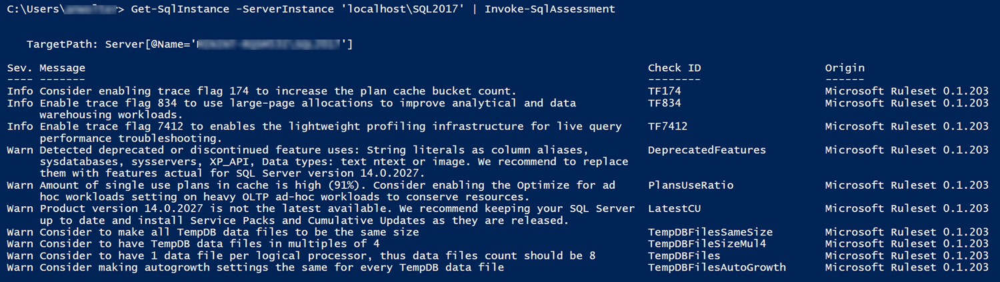

# SQL Assessment API Quick Start Guide

Assess your SQL Server configuration for best practices in 2 simple steps.

### 1. Setup

You just need to install [PowerShell SqlServer module](https://www.powershellgallery.com/packages/SqlServer) using the following command. Get-Module will show you the version you have installed. 21.1.18206 is the latest version and GA for SQL Assessment API.

```PowerShell
Install-Module -Name SqlServer -AllowClobber
Get-Module
```

### 2. Invoke an assessment

This command runs an assessment against your local SQL Server instance.

```PowerShell
Get-SqlInstance -ServerInstance 'localhost' | Invoke-SqlAssessment
```

Sample result:


You will see in the results that each rule has some properties (not the full list):

- Severity (info, warning, critical)
- Message property explains the recommendation but if you need more info, there is a HelpLink property that points at documentation on the subject.
- Origin shows which ruleset and version the recommendation is coming from

See [config.json](./config.json) for a full list of rules and properties.

If you want to get recommendations for all databases on the local instance, run this command.

```PowerShell
Get-SqlDatabase -ServerInstance 'localhost' | Invoke-SqlAssessment
```

## Learn more about SQL Assessment API

To learn more about SQL Assessment API such as customizing and extending the ruleset, saving the results in a table, etc., please visit:

- Docs online page: https://docs.microsoft.com/sql/sql-assessment-api/sql-assessment-api-overview 
- GitHub repo: http://aka.ms/sql-assessment-api
- SQL Assessment API Tutorial notebook: coming soon
