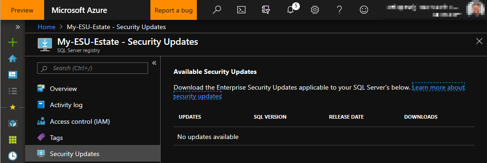

# SQL Server 2008/2008 R2 Extended Security Updates (ESUs)
SQL Server 2008 and SQL Server 2008 R2 have reached the end of their support lifecycle on July 9, 2019. 
Each version is backed by a minimum of 10 years of support (5 years for Mainstream Support and 5 years for Extended Support) including regular security updates. 
End of support means the end of security updates, which can cause security and compliance issues and put applications and business at risk. 
We recommend upgrading to current versions for the most advanced security, performance, and innovation. 

For customers that couldn’t get all servers upgraded by the deadline, new options help protect applications and data during the upgrade transition:
-  Migrate your existing SQL Server 2008 and 2008 R2 workloads as-is to Azure Virtual Machines, and receive additional three years of free Extended Security Updates (if and when available).
-  Purchase Extended Security Updates for your servers and remain protected until you are ready to upgrade to a newer SQL Server version, for up to three years after the End of Support date.

Microsoft recommends applying Extended Security Update patches as soon as they are available to keep their environment protected.

---

## Table of Contents

-  [Useful links](#Useful-links)
-  [What are Extended Security Updates for SQL Server](#What)
-  [Prepare to register SQL Server instances for ESUs](#Registry)
-  [Registering SQL Server instances for ESUs](#Register)
-  [How to download Extended Security Updates](#Download)
-  [Script examples](#scripts)

---

## Useful links
- [SQL Server 2008 / 2008 R2 lifecycle page](https://support.microsoft.com/en-us/lifecycle/search?alpha=sql%20server%202008)
- [SQL Server 2008 / 2008 R2 end of support page](https://aka.ms/sqleos)     
- [Extended Security Updates frequently asked questions](https://aka.ms/sqleosfaq)    
- [Microsoft Security Response Center (MSRC)](https://portal.msrc.microsoft.com/security-guidance/summary)
- [Manage Windows updates by using Azure Automation](https://docs.microsoft.com/azure/automation/automation-tutorial-update-management)
- [Microsoft Data Migration Guide](https://datamigration.microsoft.com/)
- [Azure Migrate - lift-and-shift options to move your current SQL 2008 / 2008 R2 into an Azure VM](https://azure.microsoft.com/services/azure-migrate/)

---

##  What are Extended Security Updates for SQL Server
Extended Security Updates (ESUs) include provision of Security Updates rated **Critical** by [MSRC](https://portal.msrc.microsoft.com/security-guidance/summary).    

ESUs will be distributed if and when available, and do not include:
-  New features
-  Customer-requested non-security hotfixes
-  Design change requests    

### Support
ESUs do not include technical support, but customers can use an active support contract such as Software Assurance or Premier/Unified Support on SQL Server 2008 / 2008 R2 to get technical support on workloads covered by ESUs if they choose to stay on-premises. Alternatively, if hosting on Azure, customers can use an Azure Support plan to get technical support.

> [!NOTE]   
> Microsoft cannot provide technical support for SQL Server 2008 / 2008 R2 instances (both on-premises and in hosting environments) that are not covered with an ESU subscription.

### ESU Availability
**In Azure:** Customers who migrate workloads to Azure Virtual Machines (IaaS) will have access to Extended Security Updates for SQL Server 2008 and 2008 R2 for three years after the End of Support dates for **no additional charges** above the cost of running the virtual machine. Customers do not need Software Assurance to receive Extended Security Updates in Azure.

**On-premises or hosted environments:** Software Assurance customers can purchase Extended Security Updates for three years after End of Support date, under an Enterprise Agreement (EA), Enterprise Subscription Agreement (EAS), a Server & Cloud Enrollment (SCE), or an Enrollment for Education Solutions (EES). Customers can purchase Extended Security Updates only for the servers they need to cover. Extended Security Updates can be purchased directly from Microsoft or a Microsoft licensing partner.

For more information, refer to the [Extended Security Updates frequently asked questions](https://aka.ms/sqleosfaq).

### ESU Delivery
**Azure Virtual Machines:** Customers will receive updates automatically through existing SQL Server update channels, whenever vulnerabilities are found, and rated **Critical** by MSRC. If an Azure Virtual Machine is not [configured to receive automatic updates](https://docs.microsoft.com/azure/automation/automation-tutorial-update-management), then the on-premises download option applies. 

**On-premises or hosted environments:** Customers that buy Extended Security Updates will be able to [register the eligible instances](#Registry) and download updates from the Azure Portal to deploy to their on-premises or hosted environments, whenever vulnerabilities are found, and rated **Critical** by MSRC. This is also the process that customers will need to follow for Azure Stack and Azure Virtual Machines that are not configured to receive automatic updates.

---

##  Prepare to register SQL Server instances for ESUs
To create your SQL Server Registry, which will allow you to register your ESU-enabled SQL Server instances, see [Create the SQL Server Registry](./registry.md).

---

##  Registering SQL Server instances for ESUs
To register your ESU-enabled SQL Server instances, see [Registering SQL Server instances for ESUs](./register.md).

---

##  How to download Extended Security Updates

To download a security update that is made available throughout the three years of the ESU subscription, click on ***Security Updates*** located in the left menu pane.
- All available ESU packages available per version will be listed
- A ***Download*** button will appear inline with each available update package, allowing customers to download, to later install in the eligible SQL Server instances.

     

---

##  ESU registration script examples

For example scripts in T-SQL and Powershell that can generate the required SQL Server instance registration information, see [ESU registration script examples](scripts.md).
