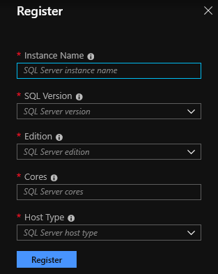
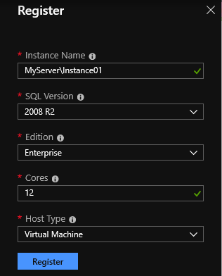
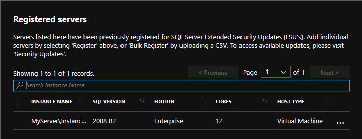
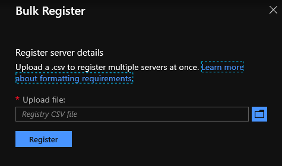

# Registering SQL Server instances for ESUs

## Table of Contents

-  [Register a single SQL Server instance](#RegSingle)
-  [Bulk register SQL Server instances](#RegBulk)
-  [Formatting requirements for a CSV file](#csv)

## <a name="RegSingle"></a> Register a single SQL Server instance
It's required that at least one SQL Server instance is registered in order to download an ESU package (if and when available). 

**Important**: It's not required to register a SQL Server instance for ESUs when running an Azure Virtual Machine that is configured for Automatic Updates. For more information, see [Manage Windows updates by using Azure Automation](https://docs.microsoft.com/azure/automation/automation-tutorial-update-management).

### Steps to register an instance
1. To register a new SQL Server instance, click the ***+ Register*** button in the top bar.

     

2. Enter the required information as seen below:
   -  **Instance Name:** enter the output of running the command `SELECT @@SERVERNAME` or `SELECT SERVERPROPERTY('ServerName')`
   -  **SQL Version:** select from the drop-down the applicable version
      - 2008
      - 2008 R2
   -  **Edition:** select from the drop-down the applicable edition
      - Datacenter
      - Developer (free to deploy if purchased ESUs)
      - Enterprise
      - Standard
      - Web
      - Workgroup 
   -  **Cores:** enter the number of cores for this instance
   -  **Host Type:** select from the drop-down the applicable environment
      - Virtual Machine (on-premises)
      - Physical Server (on-premises)
      - Azure Virtual Machine (includes Azure Stack and VMWare on Azure)
      - Amazon EC2
      - Google Compute Engine
      - Other


     

    If registering an Azure Virtual Machine (VM), additional information is required to complete registration:
    -  **Subscription Id:** enter the subscription ID on where the VM is created
    -  **Resource Group:** enter the resource group on where the VM is created
    -  **Azure VM Name:** enter the VM resource name
    -  **Azure VM Operating System:** select from the drop-down the applicable Windows Server version

3. When all fields are populated, click the ***Register*** button to complete registration.

     

4. The newly registered instance will be available in the ***Registered servers*** section of the page.

     
   
   The download area of the SQL Server Registry become accessible. Any available downloads will be posted there. For more information, see [How to download Extended Security Updates](./readme.md#Download).

---

## <a name="RegBulk"></a> Bulk register SQL Server instances 
Bulk registering SQL Server instances to download an ESU package (if and when available) is done through uploading a CSV file. 

**Important**: It's not required to register SQL Server instances for ESUs when running Azure Virtual Machines that are configured for Automatic Updates. For more information, see [Manage Windows updates by using Azure Automation](https://docs.microsoft.com/azure/automation/automation-tutorial-update-management).

Customers that already have an inventory application that holds the required registration information can generate a CSV file from that inventory, following the the [CSV formatting requirements](#csv) later in this page.

Several as-is example scripts are provided, that generate the required registration information into a CSV file. For more information, see [ESU registration script examples](scripts.md).

### Steps to bulk register
1. To bulk register new SQL Server instances, click the ***↑ Bulk Register*** button in the top bar.

    

2. Click the folder icon to search for a previously prepared CSV file that contains all the required information to register SQL Server instances. Once selected, click the ***Register*** button.

     

3. The newly registered instance(s) will be available in the ***Registered servers*** section of the page. 

   The download area of the SQL Server Registry become accessible. Any available downloads will be posted there. For more information, see [How to download Extended Security Updates](./readme.md#Download).

---

## <a name="csv"></a> Formatting requirements for CSV file

The CSV file **must** be generated with the following format:
-  Values are comma separated
-  Values are not single or double-quoted
-  Column names are case-insensitive but must be **named** as seen below:
   - name
   - version
   - edition
   - cores
   - hostType
   - subscriptionId <sup>1</sup>
   - resourceGroup <sup>1</sup>
   - azureVmName <sup>1</sup>
   - azureVmOS <sup>1</sup>

<sup>1</sup> Only for Azure Virtual Machine registrations

**Tip**: For example Powershell scripts that can generate the required SQL Server instance registration information into a CSV file, see [ESU registration script examples](scripts.md).

### CSV Example 1 - on-premises

```
name,version,edition,cores,hostType    
Server1\SQL2008,2008,Enterprise,12,Physical Server    
Server1\SQL2008 R2,2008 R2,Enterprise,12,Physical Server    
Server2\SQL2008 R2,2008 R2,Enterprise,24,Physical Server    
Server3\SQL2008 R2,2008 R2,Enterprise,12,Virtual Machine    
Server4\SQL2008,2008,Developer,8,Physical Server  
```

Refer to [MyPhysicalServers.csv](./scripts/MyPhysicalServers.csv) for a CSV file example.

### CSV Example 2 - Azure VM

```
name,version,edition,cores,hostType,subscriptionId,resourceGroup,azureVmName,azureVmOS    
ProdServerUS1\SQL01,2008 R2,Enterprise,12,Azure Virtual Machine,61868ab8-16d4-44ec-a9ff-f35d05922847,RG,VM1,2012    
ProdServerUS1\SQL02,2008 R2,Enterprise,24,Azure Virtual Machine,61868ab8-16d4-44ec-a9ff-f35d05922847,RG,VM1,2012    
ServerUS2\SQL01,2008,Enterprise,12,Azure Virtual Machine,61868ab8-16d4-44ec-a9ff-f35d05922847,RG,VM2,2012 R2    
ServerUS2\SQL02,2008,Enterprise,8,Azure Virtual Machine,61868ab8-16d4-44ec-a9ff-f35d05922847,RG,VM2,2012 R2    
SalesServer\SQLProdSales,2008 R2,Developer,8,Azure Virtual Machine,61868ab8-16d4-44ec-a9ff-f35d05922847,RG,VM3,2008 R2   
```

Refer to [MyAzureVMs.csv](./scripts/MyAzureVMs.csv) for an Azure VM targetted CSV file example.
