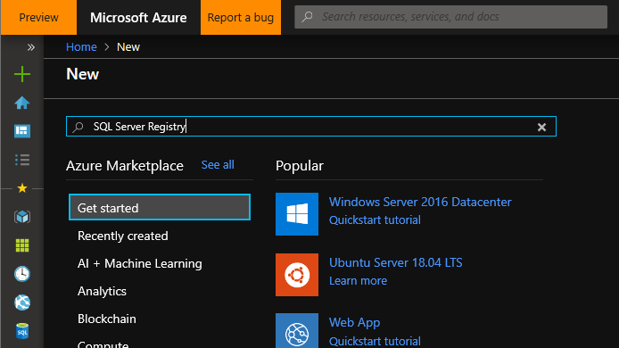
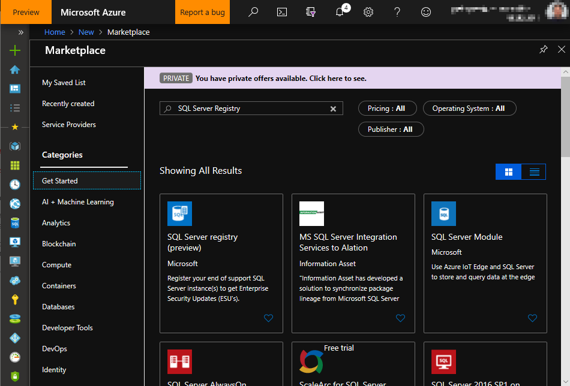
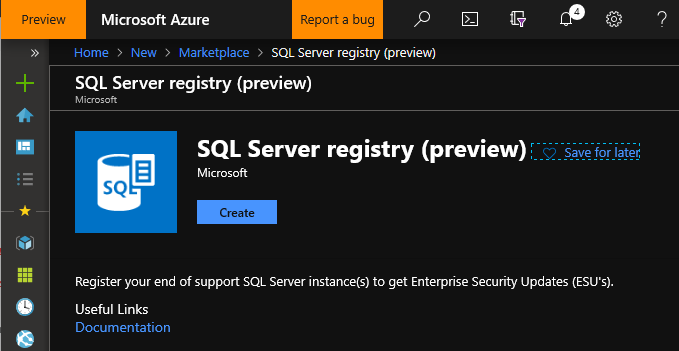
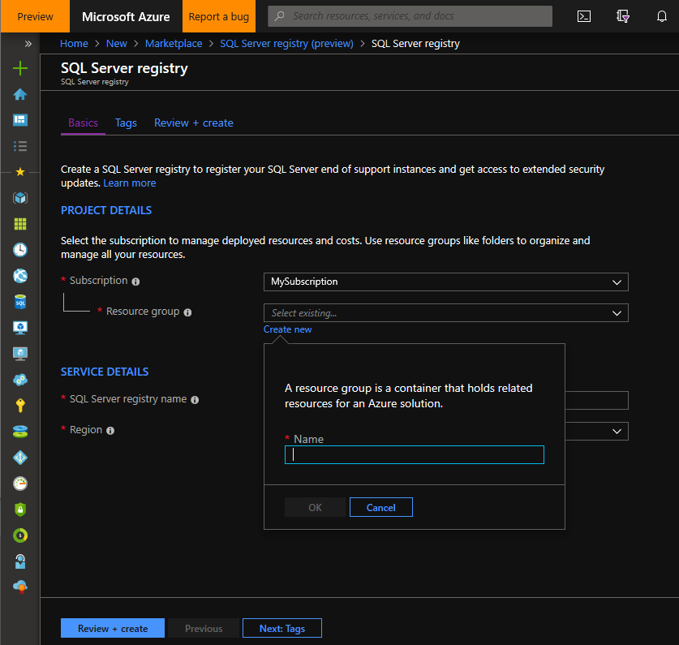
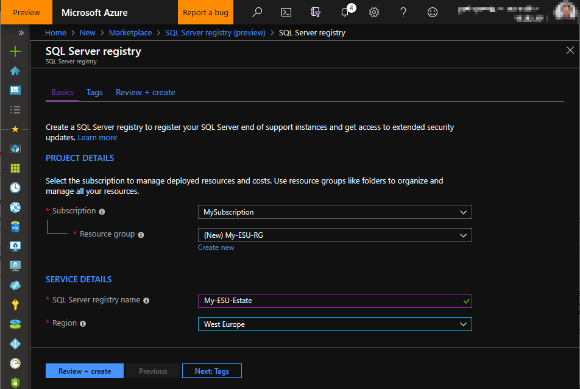
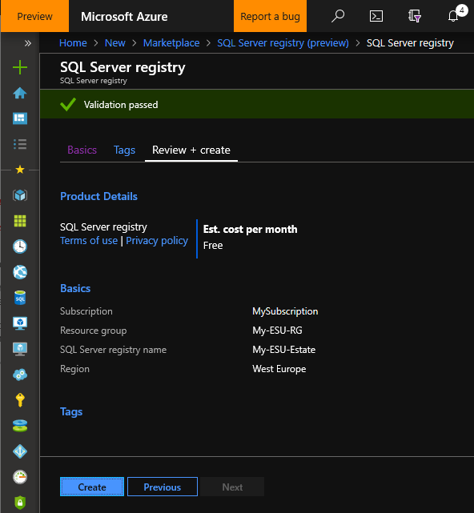
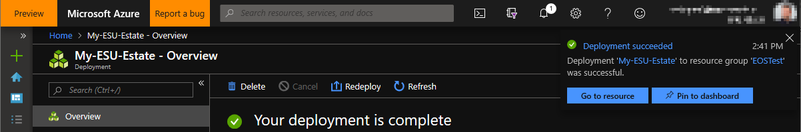
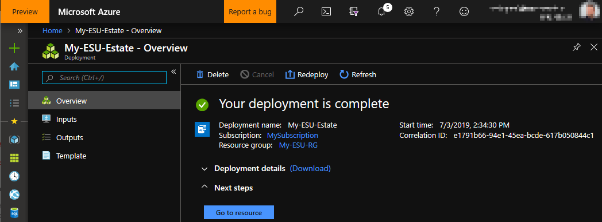
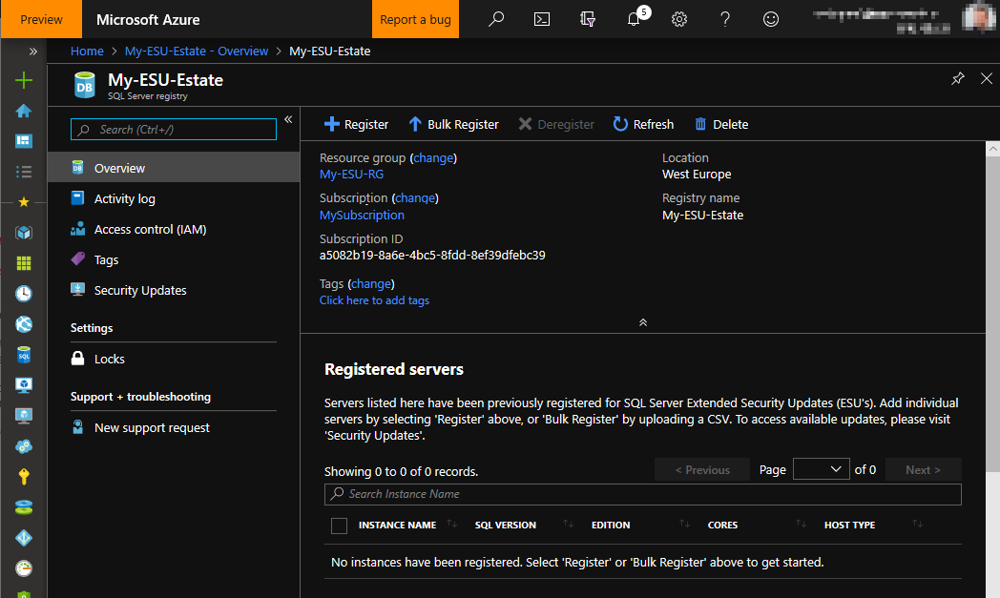

# Create the SQL Server Registry
Before being able access the Extended Security Updates (ESU) download area in the Azure portal, the SQL Server instances covered by ESUs must be registered. This ensures that you are able to download an ESU package if and when available.

**Important**: It's not required to register a SQL Server instance for ESUs when running an Azure Virtual Machine that is configured for Automatic Updates. For more information, see [Manage Windows updates by using Azure Automation](https://docs.microsoft.com/azure/automation/automation-tutorial-update-management).

##  Prepare to register SQL Server instances
To register SQL Server instances, you must first create a SQL Server Registry in the [Azure portal](https://portal.azure.com/#create/Microsoft.SqlServerRegistration). 

**Note**: This operation only needs to be done once. After a SQL Server Registry is created, it can be used to register multiple SQL Server instances.

### Steps
1. Open the [Azure portal](https://portal.azure.com) and log in.

2. If this is your first time registering a SQL Server instance, click the plus (+) sign in the top-left area of the page to create a new resource. Then type *SQL Server Registry* in the text box and hit the **Enter** key.

     

3. The SQL Server Registry resource should be available. Click on it begin the Registry setup process.

     

4. After selecting the SQL Server Registry resource, click on the *Create* button.

     

5. In the **PROJECT DETAILS** section, select the ***subscription*** on which to create the Registry. Then, select either an existing ***Resource group***, or create a new one.

     

   In the **SERVICE DETAILS** section, enter a name for the ***SQL Server registry***, and select a ***Region*** on which to deploy this new resource.

     

    And then click on the ***Review + create*** button.

6. If the validation passed, you are presented with a screen that summarizes the choices for the new registry resource. If everything seems correct, click on the ***Create*** button to start deployment of the new resource.

     

7. Once deployment is complete, click on the ***Go to resource*** button.

     

     

8. Now the **SQL Server Registry** is available.

     

    To start registering SQL Server instances, see [Registering SQL Server instances](./register.md).
